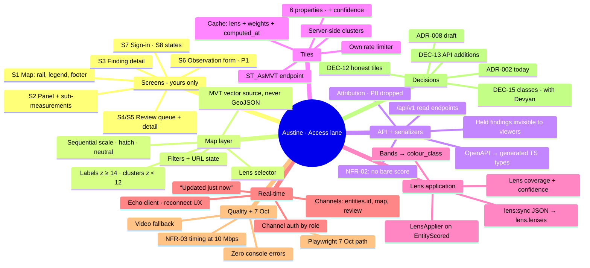
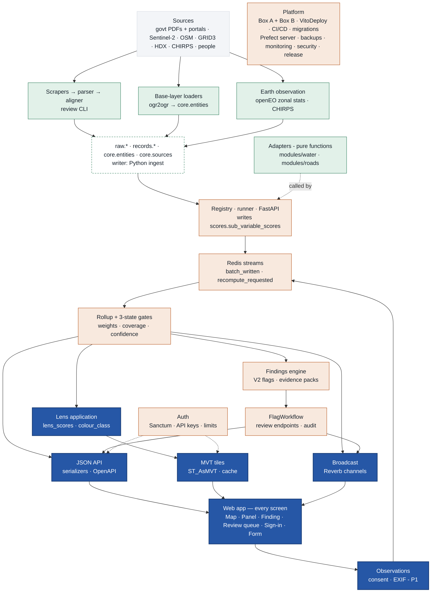
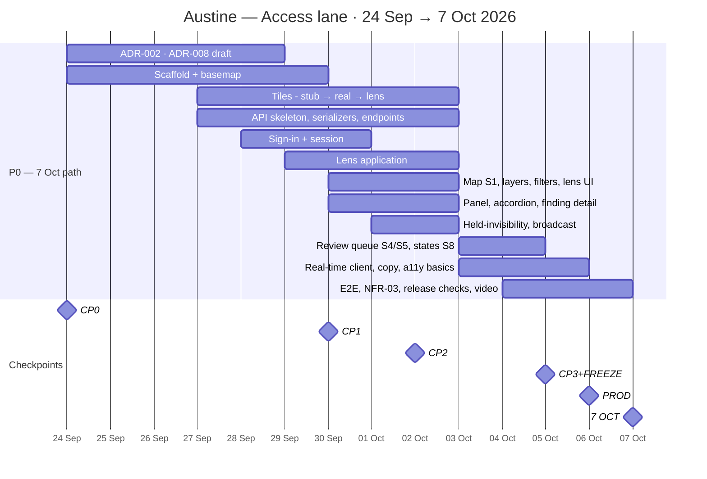
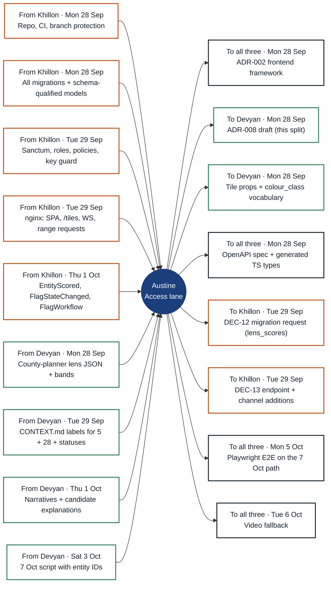

# Navuuna work pack — Austine
**Access lane · CTO (Frontend)** · Split rev 3 · key date 7 Oct · Sun 27 Sep 2026 · Internal

> All frontend (yours alone) plus the backend that serves it: JSON API and serializers, map tiles, lens application, real-time broadcast, observations.
>
> **Key date: Wednesday 7 October 2026** — re-dated Sun 27 Sep (was 15 Oct). 10 days to go; the date does not move.
>
> Split binding once Devyan ratifies ADR-008 (Mon 28 Sep). Scope trims are marked **7 Oct trim** / **Moved after 7 Oct** and need Devyan's confirmation (DEC-23).

## The three lanes

| Lane | Person | Scope |
|---|---|---|
| **Signal lane** | Devyan Jethwa A. — Founder, CTIPSO | Everything that turns sources into scores: base layers, scrapers, parsers, aligners, Earth observation, all 17 adapters — plus product decisions and 7 Oct. |
| **Core lane** | Khillon — CTO (Backend) | Platform and engine: both boxes, CI/CD, database, signal-service runner, rollup, findings workflow, auth, security, release. |
| **Access lane** · **you** | Austine — CTO (Frontend) | All frontend (yours alone) plus the backend that serves it: JSON API and serializers, map tiles, lens application, real-time broadcast, observations. |

### Your backend share

- JSON API `/api/v1` + NFR-02 serializers + OpenAPI
- MVT tile endpoint + tile cache
- Lens application → `lens.lens_scores`
- Reverb broadcast layer (channels, events, auth)
- Observations, consent, EXIF (P1) + 7 Oct simulate command

### Your other software work

- Every screen S1–S8 — the frontend is yours alone
- Playwright E2E, NFR-03 timing, video fallback
- ADR-002; ADR-008 draft; DEC-12, DEC-13

### Next 48 hours — Mon 28 and Tue 29 Sep

1. Mon 28: if still open, decide ADR-002 (Vue 3 or React) first thing — every screen waits on it.
2. Mon 28: get Devyan's answer on the 7 Oct scope (DEC-23) and his ratification of ADR-008.
3. Scaffold `apps/web` + the `web` CI job; basemap on staging by Tue 29.
4. Access-layer skeleton, generated API types and the NFR-02 serializer guard by Tue 29.
5. Tile endpoint serving real water points by Tue 29; sign-in by Wed 30.
6. Wed 30 Sep 16:00 (CP1): one real water point from sub-scores to the panel.

### The seven things to show on 7 Oct (Bible §3.3)

| # | Item | Leads | Supports |
|---|---|---|---|
| 1 | Nairobi map with ≥ 200 water & sanitation entities loaded and scored | **Devyan** | Khillon, Austine |
| 2 | Any entity: five variable scores with coverage, confidence and the sub-variable breakdown | **Khillon** + **Austine** | Devyan |
| 3 | ≥ 3 findings, each with an evidence pack and a visible hold / release state | **Khillon** | Devyan, Austine |
| 4 | One working lens (county planner) that re-colours the map | **Austine** | Devyan |
| 5 | One road segment scored from one hand-picked public contract | **Devyan** | Khillon |
| 6 | A new observation changes the score on screen — live via Reverb, or on refresh (decided Mon 5 Oct) | **Austine** | Khillon |
| 7 | The API returns the same entity as JSON | **Austine** | Khillon |

**How to read this pack.** Sections 1–8 are yours. The appendix is identical in all three packs. Task IDs (A-, K-, D-) become GitHub issue titles (§14.10); Bible v1.1 task numbers are kept in the refs.

**Read from:** Build Bible v1.1 (20 Sep — supersedes the v1.0 copy in the project) · PRD-001 v1.0 (20 Sep) · Proposal v1.0 (18 Sep) · Open Questions (20 Sep — all six closed by v1.1) · Pitch graphics (22 Sep): platform infographic + Parcel Passport

---

## 1 · Your map

---

## 2 · Who owns what — the whole system

Data flows top to bottom. Solid = yours (Access lane); tinted = a teammate's; dashed = shared store. Colours: green Devyan · orange Khillon · blue Austine.

### What moved compared with Bible v1.1

| Work | Bible v1.1 | This split |
|---|---|---|
| FR-07 / FR-08 adapter code | Devyan spec · Khillon code | Devyan spec **and** code · Khillon reviews |
| JSON endpoints FR-16 (K2.5) | Khillon | Austine — auth, API keys, limits stay Khillon |
| MVT tiles + tile cache (K2.6, K3.2) | Khillon | Austine |
| Lens engine FR-12 (K3.1) | Khillon | Austine (lens content stays Devyan) |
| Reverb events (K3.3) | Khillon | Austine broadcasts · Khillon emits domain events |
| Transition endpoint (K3.4) | Khillon | Khillon, plus `GET /flags` queue endpoint |
| FR-17 observations backend | Austine + Khillon | Austine (P1; 7 Oct fallback command is P0) |
| Prefect flows | Khillon | Devyan writes ingest flows · Khillon runs server/worker + scoring flow |
| API key issuing (Week 4) | Khillon | Khillon, pulled forward to W1 |
| Roads scraper fetch (D3.1) | Devyan, Week 3 | Devyan, pulled forward to W1 |
| Offline laptop fallback | Devyan (Bible) / Austine (PRD R10) | Khillon builds the stack · Austine records video |
| Sprint dates §13 | Weeks 1–4 from 18 Sep | Re-dated Sun 27 Sep: key date Wed 7 Oct (was 15 Oct); CP1 30 Sep · CP2 2 Oct · CP3 5 Oct |

---

## 3 · Your timeline — to 7 October

| Checkpoint | When | Must be true on staging |
|---|---|---|
| **CP0** · Decisions + skeleton | Thu 24 Sep | ADR-002, ADR-004a, ADR-008, ADR-009 · repo + CI green · boxes reachable · basemap local · `weights.yml` in repo — anything still open is due Mon 28 Sep |
| **CP1** · Foundations + first slice | Wed 30 Sep 16:00 | Base layers loaded · one real water entity flows sub-scores → rollup → API → panel on staging |
| **CP2** · Water module | Fri 2 Oct 16:00 | ≥ 200 water entities with ≥ 3 measured sub-variables · ≥ 3 findings held with packs · lens recolours map · panel on real data |
| **CP3** · Built + frozen | Mon 5 Oct 16:00 | All 7 items on staging incl. one road finding and the review path · live update or refresh decided (12:00) · E2E green · data frozen · rehearsal 1 |
| **PROD** · Production | Tue 6 Oct | `v0.1.0` on the production URL · rehearsal 2 · video recorded · offline stack tested |
| **7 OCT** · Key date | Wed 7 Oct | Seven items from Bible §3.3, live, on production |

> **Load check.** Rough sizing (used only to balance the lanes): even after the 7 Oct trims, P0 work is ≈ 15–17 person-days per lane, against 8 weekdays (Mon 28 Sep – Wed 7 Oct) plus two weekend days. The plan only holds with early decisions, weekend work and same-day reviews. If a checkpoint slips, the next cut comes from the risk table — never from the “never cut” list.

---

## 4 · Your tasks

Done means merged to `main`, green, on staging and shown at the next checkpoint (§14.8). Due dates are the latest acceptable day, not a target.

### W0 · now, by Mon 28 Sep · Decisions + skeleton (anything from CP0 still open)

- [ ] **A-01 · ADR-002: Vue 3 or React** — due **Mon 28 Sep**
  - **Do:** If still open, decide first thing Mon 28 Sep (was due 22 Sep; PRD R8 — if undecided, Devyan picks). Both drive MapLibre directly (no wrapper) and have Laravel Echo bindings. Record the data-fetching/state choice in the same ADR so it is never reopened.
  - **Done when:** ADR-002 merged in `docs/adr/`
  - **Needs:** K-01 repo · **Refs:** A1.1, R8
- [ ] **A-02 · Draft ADR-008 — three-lane split** — due **Mon 28 Sep**
  - **Do:** From this pack: moves vs v1.1, new §4.2/§12 rows, CODEOWNERS map. Devyan ratifies at CP0.
  - **Done when:** ADR PR open; Devyan approves
  - **Needs:** — · **Refs:** §12, §14.9
- [ ] **A-03 · Scaffold `apps/web`** — due **Mon 28 Sep**
  - **Do:** Vite + TypeScript strict (no `any`) + Tailwind; eslint, prettier, vitest, `tsc --noEmit`. Folders: `src/map`, `src/panel`, `src/findings`, `src/review`, `src/realtime`, `src/api` (generated types only), `src/ui`. Add the `web` job to `ci.yml` — Khillon hosts CI, you own the job.
  - **Done when:** `web` CI job green on the first PR
  - **Needs:** K-01, K-05 · **Refs:** A1.2, §14.5
- [ ] **A-04 · Self-hosted basemap** — due **Mon 28 / Tue 29 Sep**
  - **Do:** `apps/web/scripts/build-basemap.sh`: `pmtiles extract` from the Protomaps daily build, Nairobi County bbox + margin. Self-host glyphs and sprites — labels (and the z ≥ 14 score labels) do not render without glyphs. Protomaps light style; register the `pmtiles://` protocol. Never commit the `.pmtiles` file (> 1 MB rule); nginx on Box A serves it with HTTP range requests.
  - **Done when:** Renders locally (Mon 28); on staging (Tue 29)
  - **Needs:** K-07 nginx · **Refs:** A1.3, FR-13
- [ ] **A-05 · Tile contract stub** — due **Mon 28 Sep**
  - **Do:** Property list + colour_class vocabulary (b1–b4 bands, `p` suffix = partly verified hatch, `ca` = cannot assess) → Devyan (DEC-15) and Khillon (DEC-12). Serve stub dots from the real `/tiles/{z}/{x}/{y}.mvt` path so the MapLibre `vector` source is right from day one.
  - **Done when:** Map shows dots from MVT, not GeoJSON
  - **Needs:** — · **Refs:** A1.4, ADR-005

### W1 · Mon 28 – Wed 30 Sep · Foundations + first slice (CP1 Wed 30 Sep)

- [ ] **A-06 · Access-layer skeleton + OpenAPI** — due **Mon 28 Sep**
  - **Do:** `/api/v1` routes, `Api/V1` controllers, API Resources, FormRequests. OpenAPI generated from code (Scramble or L5-Swagger) at `/api/v1/openapi.json`; `npm run gen:api` (openapi-typescript) writes `src/api/schema.d.ts`; CI fails if generated types are stale.
  - **Done when:** Types regenerate from the live spec; stale-type check in CI
  - **Needs:** K-06, K-11 · **Refs:** US-701, §14.5
- [ ] **A-07 · NFR-02 serializer guard** — due **Tue 29 Sep**
  - **Do:** One base resource for anything with a score; it throws if a score is present without coverage and confidence. Variable fields: `score, coverage, confidence, status, gate_status, measured_count, total_count, computed_at`. Sub-variable: `value, unit, score, confidence, status, null_reason, observed_at, sources[{name, kind, date}]`. Entity: `last_observed_at` and `last_computed_at` as separate fields (US-502).
  - **Done when:** Pest test proves a bare score cannot be emitted (release 15.2)
  - **Needs:** K-06 · **Refs:** NFR-02, US-201, US-502
- [ ] **A-08 · JSON endpoints (FR-16)** — due **Wed 30 Sep / Fri 2 Oct**
  - **Do:** `GET /entities` — bbox required, max 500 features, 422 with a clear message when bbox is missing or too large, filters module/type/lens. `GET /entities/{id}` (retired still retrievable, E15). `GET /entities/{id}/scores?variable=`. `GET /entities/{id}/flags` — published/resolved only; provisional → empty + reason. `GET /lenses`. Attribution block in every response (NFR-09); PII-tagged fields dropped (NFR-06). Pest integration tests on seeded PostGIS.
  - **Done when:** First real entity at CP1; all five green
  - **Needs:** K-06, K-10, D-14 · **Refs:** FR-16, §11.1
- [ ] **A-09 · MVT endpoint (real)** — due **Tue 29 Sep (geometry) · Fri 2 Oct (lens)**
  - **Do:** `ST_TileEnvelope` + `ST_AsMVTGeom` (4326 → 3857) + `ST_AsMVT` over `core.entities` ⋈ `lens.lens_scores`. Properties only: `id, entity_type, module, lens_score, colour_class, coverage` (+ `confidence`, `name` at z ≥ 14 if DEC-12 passes). Exclude retired entities and disabled modules. **z < 12: clusters built in SQL** (grid snap + count, no score) — MapLibre clusters only GeoJSON sources. Gzip; `application/vnd.mapbox-vector-tile`; session auth; its own limiter — never the 60/min API-key limiter (one map load fetches dozens of tiles). **7 Oct trim (proposed, DEC-23):** server-side clusters only if more than ~1,000 features show at once; default tiles show water points, wards and the one road.
  - **Done when:** Real Nairobi water layer renders; valid-MVT test (§14.7)
  - **Needs:** D-05, A-11 · **Refs:** ADR-005, §11.2, K2.6
- [ ] **A-10 · Sign-in S7 + session** — due **Wed 30 Sep**
  - **Do:** Sanctum SPA cookie auth on the same origin (no CORS); `GET /me`; sign-out; role-aware routes (viewer / analyst / admin); 401 handling.
  - **Done when:** Sign-in works on staging; viewer cannot reach review screens
  - **Needs:** K-11 · **Refs:** PRD S7
- [ ] **A-11 · Lens application (FR-12)** — due **Fri 2 Oct**
  - **Do:** Validate lens JSON: 5 variable weights summing to 1.00, direction per variable, bands; reject any `sub_weights` key (ADR-007). `php artisan lens:sync` → `lens.lenses` (versioned). `LensApplier` on `EntityScored`: weighted mean over available variables (renormalised; `cannot_assess` excluded; 100 − score where the lens says lower is better) → colour_class → lens coverage + confidence (DEC-12) → `lens.lens_scores`. `lens:apply --all`. Unit tests: known variable scores → known lens score.
  - **Done when:** Tiles carry the county-planner lens_score (K3.1)
  - **Needs:** D-10 lens JSON, K-10 · **Refs:** FR-12, §6.6, ADR-007

### W2 · Thu 1 – Fri 2 Oct · Water module (CP2 Fri 2 Oct)

- [ ] **A-12 · Map S1 layout** — due **Thu 1 Oct**
  - **Do:** Header (lens selector, help, user). Left rail: filters + legend; collapses into a sheet under 900 px. Permanent footer: “Contains modified Copernicus Sentinel data 2026 · © OpenStreetMap contributors · Digital Earth Africa · GRID3” — never dismissable.
  - **Done when:** Matches PRD 9.2 on staging
  - **Needs:** — · **Refs:** FR-13, NFR-09
- [ ] **A-13 · Entity layers on MVT** — due **Thu 1 Oct**
  - **Do:** `vector` source only. Circles (points), lines (segments), fill + outline (areas). One sequential, colour-blind-safe scale — not red-amber-green. Hatch = partly verified; neutral pattern = cannot assess, never drawn as 0. Numeric label at z ≥ 14; cluster bubbles with counts below z 12. `promoteId: 'id'` for hover/selected feature-state. Tooltip: “Name · 41 · based on 4 of 6 · confidence good” (DEC-11/12). **7 Oct trim (proposed, DEC-23):** cluster bubbles only if A-09 clusters ship.
  - **Done when:** US-101 and US-102 acceptance criteria pass
  - **Needs:** A-09 · **Refs:** FR-13, US-101/102
- [ ] **A-14 · Filters + URL state** — due **Fri 2 Oct**
  - **Do:** Module and entity-type filters as tile query params (no reload); active filters visible and clearable in one action; URL holds lens, filters, centre/zoom, selected entity.
  - **Done when:** US-103 passes; a pasted link restores the view
  - **Needs:** A-13 · **Refs:** US-103, A3.1
- [ ] **A-15 · Lens selector** — due **Fri 2 Oct**
  - **Do:** Reads `GET /lenses`; County planner preselected; switching swaps the tile URL `?lens=` → recolour in under 2 s; lens name in header and legend. Panel variable scores must not change on a lens switch.
  - **Done when:** US-301 passes
  - **Needs:** A-11 · **Refs:** FR-12, US-301
- [ ] **A-16 · Entity panel S2** — due **Thu 1 Oct (one entity at CP1)**
  - **Do:** Opens on click (id from tile) → `GET /entities/{id}`; closes by Esc, ×, or map click. Header: name · type · ward; “Last observed” and “Scored” as two labelled fields. Findings row only if published findings exist. Five variables in fixed order with plain names; integer score; coverage bar + “X of Y”; confidence bar + word (low < 0.4, medium 0.4–0.7, good ≥ 0.7). Badges: Partly verified (reason on hover); Cannot assess (no score). E3: “Not enough data to assess this yet”. Missing coverage/confidence → error state, never a bare score. Skeleton loader; p95 < 500 ms.
  - **Done when:** US-201, US-203, US-502 pass on staging
  - **Needs:** A-08, D-09, DEC-20 · **Refs:** FR-14, A2.1–A2.3
- [ ] **A-17 · Sub-measurement accordion** — due **Fri 2 Oct**
  - **Do:** Plain-language label per sub-variable (CONTEXT.md); internal ID on hover for analyst/admin only; value + unit; confidence to 2 decimals; sources as “WASREB scheme register, 12 Mar 2026”; unmeasured rows listed with their reason — never 0 or a dash; one open at a time on mobile.
  - **Done when:** US-202 passes
  - **Needs:** D-09 labels · **Refs:** US-202, A2.2
- [ ] **A-18 · Finding detail S3** — due **Fri 2 Oct**
  - **Do:** What the record says / what we observe / the gap / dates + sources for both / narrative / published date / “If this is wrong, tell us — [email]”. E7: both records shown with dates. Provisional entity: “No findings are raised for a location we could not verify.” Copy describes the gap — never a cause, intent or person.
  - **Done when:** US-204 passes
  - **Needs:** K-13, D-20; email from DEC-17 · **Refs:** US-204, A2.4
- [ ] **A-19 · Held-finding invisibility** — due **Fri 2 Oct**
  - **Do:** Viewer role never receives a held finding, a count, a placeholder or a V2 signal (DEC-08) — in `/entities/{id}`, `/flags`, tiles or channels. Tests with a held-finding fixture on every path.
  - **Done when:** Tests green; merge-blocking
  - **Needs:** K-13, DEC-08 · **Refs:** §15, PRD 10.2, 14.4
- [ ] **A-21 · Broadcast layer (FR-15 server side)** — due **Fri 2 Oct**
  - **Do:** Private `entities.{id}` (`score.updated`; `flag.changed` for published findings only), private `map` (tile invalidation), private `review` (queue changes, analyst/admin only). Authorisation in `routes/channels.php` by role. Listeners on Khillon's `EntityScored` / `FlagStateChanged`. Payloads carry ids + timestamps only; the client refetches. **7 Oct trim (proposed, DEC-23):** if live push is not working by Mon 5 Oct 12:00, 7 Oct shows the change after a page refresh (Bible cut #3).
  - **Done when:** A change in one browser appears in another (K3.3)
  - **Needs:** K-10, K-14, K-04 Reverb · **Refs:** FR-15, US-501

### W3 · Sat 3 – Mon 5 Oct · Road, review, real-time, hardening, freeze (CP3 Mon 5 Oct)

- [ ] **A-22 · Review queue S4 + detail S5 (FR-11)** — due **Sat 3 Oct**
  - **Do:** Table: entity, sub-measurement, gap, detected, state, age; newest first; state filter. Detail: full evidence pack + explanation-check block (Devyan's candidate list, checked / not checked, mandatory note). Publish / Dismiss / Needs more evidence disabled until the note has content (tooltip says why). Banner: “Not visible to other users until published.” No bulk action anywhere.
  - **Done when:** Full held → published path on staging (A3.2)
  - **Needs:** K-14, D-20 · **Refs:** FR-11, US-401/402
- [ ] **A-23 · Real-time client** — due **Mon 5 Oct**
  - **Do:** Laravel Echo on Reverb. Subscribe `entities.{id}` for the open panel and `map` for the viewport. On update: refetch panel, show “Updated just now” (+ “includes a community observation”), refresh affected tiles/feature-state. Never move the map or close the panel. “Reconnecting” indicator; refetch on reconnect; E13 “Live updates unavailable” + manual refresh. **7 Oct trim (proposed, DEC-23):** same Mon 5 Oct 12:00 decision as A-21.
  - **Done when:** US-501 passes; propagation < 5 s
  - **Needs:** A-21 · **Refs:** FR-15, US-501, A3.4
- [ ] **A-24 · Empty + error states S8** — due **Sat 3 Oct**
  - **Do:** Every row of PRD 9.6; tile-failure inline retry (US-101).
  - **Done when:** Each state reproducible on staging
  - **Needs:** — · **Refs:** PRD 9.6
- [ ] **A-25 · Mobile 390 px + accessibility** — due **Mon 5 Oct**
  - **Do:** Panel as bottom sheet, rail as sheet, no horizontal scroll in the panel. WCAG 2.1 AA contrast; keyboard navigation of panel, queue, forms; visible focus; map controls reachable. **7 Oct trim (proposed, DEC-23):** keyboard, focus and contrast on the 7 Oct path only; the 390 px mobile layout moves after 7 Oct.
  - **Done when:** Usable at 390 px; keyboard walk-through passes
  - **Needs:** — · **Refs:** A3.5, PRD §12
- [ ] **A-26 · Copy pass** — due **Mon 5 Oct**
  - **Do:** PRD §10: words, prohibitions, formats — “14 Sep 2026”, relative time only under 24 h, integer scores, units always. Apply the DEC-20 vocabulary (Passport, variable names) everywhere on screen.
  - **Done when:** No banned word on the 7 Oct path
  - **Needs:** DEC-20 · **Refs:** PRD §10
- [ ] **A-27 · 7 Oct fallback: `observations:simulate`** — due **Sat 3 Oct**
  - **Do:** Artisan command: writes a community observation for an entity with a test consent and publishes `signals.recompute_requested`. Keeps the live beat alive if the form is cut.
  - **Done when:** Score changes on screen from the command
  - **Needs:** K-03 stream, K-09 · **Refs:** Bible cut order

### W4 · Tue 6 – Wed 7 Oct · Production and 7 October

- [ ] **A-28 · Playwright E2E** — due **Mon 5 Oct**
  - **Do:** Map → entity → finding → evidence → transition (analyst). Lens switch leaves panel variable scores unchanged (US-301 P0 check). Viewer never sees a held finding. Runs in CI on the seeded stack and against staging before the production deploy.
  - **Done when:** Green on staging Mon 5, on prod Tue 6
  - **Needs:** D-27 7 Oct entity IDs · **Refs:** §14.7, PRD 15.2
- [ ] **A-29 · NFR-03 measurement** — due **Sat 3 (measure) · Mon 5 Oct**
  - **Do:** Throttled 10 Mbps profile: first tiles < 1.5 s, full viewport < 3 s, panel p95 < 500 ms; `map_loaded` timing event; numbers in `docs/perf.md`. **7 Oct trim (proposed, DEC-23):** measure on the 7 Oct data set; the 5,000-entity target is re-checked after 7 Oct.
  - **Done when:** Targets met or a named fix
  - **Needs:** K-18 · **Refs:** NFR-03
- [ ] **A-30 · Release checks you sign** — due **Mon 5 Oct**
  - **Do:** Zero console errors on the 7 Oct path; attribution in UI and API; PII absent from API; serializer guard test; EXIF test if A-31 shipped.
  - **Done when:** Ticked in the release checklist
  - **Needs:** — · **Refs:** PRD §15
- [ ] **A-31 · Video fallback + offline check** — due **Tue 6 Oct**
  - **Do:** Record the full 12-minute script from production after deploy. Run the UI once on Khillon's offline stack.
  - **Done when:** Video stored; offline run checked
  - **Needs:** K-20 · **Refs:** PRD R10, 15.5

### After 7 Oct (P1 and moved items — due 31 Oct)

- [ ] **A-20 · Tile cache** `P1` — due **After 7 Oct**
  - **Do:** Key `lens_id + weight_version + last_computed_at`; stored in Redis on Box A; invalidated on the lens-applied event; log hit rate. **Moved after 7 Oct (proposed, DEC-23):** a few hundred features load fast without a tile cache.
  - **Done when:** Second load of a tile served from cache (K3.2)
  - **Needs:** A-09, A-11 · **Refs:** §11.2
- [ ] **A-32 · Observations form + endpoint (cut #1)** `P1` — due **After 7 Oct**
  - **Do:** `POST /observations` (auth; type operational / not operational / does not exist here / other; text; optional photo; coordinates; consent) → `core.consents` with text version + `core.observations` kind `community`. EXIF location/device stripped by re-encoding; chosen coordinates kept; photo to a private MinIO bucket; publish recompute. `POST /observations/{id}/withdraw` → recompute, removal < 24 h, logged. Modal S6: unticked consent box with full text visible. **Already applied for 7 Oct:** the public report form moved after 7 Oct; the live beat uses A-27.
  - **Done when:** Submission changes a score; EXIF test passes
  - **Needs:** D-21, DEC-17 consent text · **Refs:** FR-17, US-601/602
- [ ] **A-33 · Telemetry + analyst extras** `P1` — due **31 Oct**
  - **Do:** PRD §13 events → `POST /api/v1/telemetry` (batched) → JSON log channel — no trackers, no new table. Analyst count “unmatched records: N” (E5). Lens info control (US-302).
  - **Done when:** Events visible in logs
  - **Needs:** — · **Refs:** PRD §13, US-302

---

## 5 · Handoffs

If a handoff will be late, say so in the 10:00 async on or before its date — not after. Work against stubs, fixtures and the OpenAPI spec meanwhile.

### What you need

| From | By | What |
|---|---|---|
| Khillon | Mon 28 Sep | Repo, CI, branch protection |
| Khillon | Mon 28 Sep | All migrations + schema-qualified models |
| Khillon | Tue 29 Sep | Sanctum, roles, policies, key guard |
| Khillon | Tue 29 Sep | nginx: SPA, /tiles, WS, range requests |
| Khillon | Thu 1 Oct | EntityScored, FlagStateChanged, FlagWorkflow |
| Devyan | Mon 28 Sep | County-planner lens JSON + bands |
| Devyan | Tue 29 Sep | CONTEXT.md labels for 5 + 28 + statuses |
| Devyan | Thu 1 Oct | Narratives + candidate explanations |
| Devyan | Sat 3 Oct | 7 Oct script with entity IDs |

### What you owe

| To | By | What |
|---|---|---|
| all three | Mon 28 Sep | ADR-002 frontend framework |
| Devyan | Mon 28 Sep | ADR-008 draft (this split) |
| Devyan | Mon 28 Sep | Tile props + colour_class vocabulary |
| all three | Mon 28 Sep | OpenAPI spec + generated TS types |
| Khillon | Tue 29 Sep | DEC-12 migration request (lens_scores) |
| Khillon | Tue 29 Sep | DEC-13 endpoint + channel additions |
| all three | Mon 5 Oct | Playwright E2E on the 7 Oct path |
| all three | Tue 6 Oct | Video fallback |

---

## 6 · Decisions

### You decide — write it down as an ADR or Bible entry the same day (§12)

| ID | Decision | Owner | Due | Recommendation |
|---|---|---|---|---|
| **DEC-03** | ADR-002: Vue 3 or React (was due 22 Sep). | Austine | Mon 28 Sep — overdue if open | Pick the one you ship fastest in. PRD R8: if undecided, Devyan picks. |
| **DEC-12** | Honest tiles: `lens.lens_scores` has no coverage/confidence; tiles carry no confidence or name, yet PRD tooltip shows name + score. | Austine | Tue 29 Sep | Add coverage + confidence columns; add `confidence` (and `name` at z ≥ 14) to tile properties. ADR-005 amendment. |
| **DEC-13** | §11 gaps: no queue endpoint, no sign-in/`me`, no withdraw, one WS channel per entity only. | Austine | Tue 29 Sep | Add `GET /flags?state=`, `GET /me`, sign-in/out, `POST /observations/{id}/withdraw`, WS `map` + `review`. |

### You are waiting on — chase on the due date; build against the recommendation meanwhile

| ID | Decision | Owner | Due | Recommendation |
|---|---|---|---|---|
| **DEC-23** | Key date moved to Wed 7 Oct: confirm the trimmed scope — tasks marked “7 Oct trim” and those moved after 7 Oct. | Devyan | Mon 28 Sep | Confirm, or tell each owner which trim to reverse and what to drop instead. |
| **DEC-01** | Ratify this three-lane split as ADR-008; update Bible §4.1, §4.2, §12, §19 (v1.2). | Devyan | Mon 28 Sep — overdue if open | Adopt. Austine drafts the ADR. |
| **DEC-04** | ADR-009: Laravel 13, not 11. Laravel 11 security fixes ended 12 Mar 2026; 13 runs on PHP 8.3. | Khillon | Mon 28 Sep — overdue if open | Laravel 13. PHP pin unchanged. |
| **DEC-05** | ADR-004a: table-level writer matrix, DB role GRANTs, Redis stream contracts, reconciliation sweep. | Khillon | Mon 28 Sep — overdue if open | Adopt appendix matrix. Devyan signs. |
| **DEC-08** | V2 while a finding is held: gaps under review must not reach viewers via the V2 score, lens colour or tiles. | Devyan | Mon 28 Sep | Rollup excludes 2.x sub-variables with an unpublished finding from the stored V2 row; re-roll on publish/dismiss. |
| **DEC-10** | PRD buttons (Publish / Dismiss / Needs more evidence) vs Bible lifecycle (explanation_checked step). | Devyan | Tue 29 Sep | One request records held → explanation_checked (+ explanation) → published/dismissed with the same note. Needs more evidence = stays held, note-only audit event. |
| **DEC-11** | “X of Y” definition. PRD mock shows “4 of 6” on Activity, but V1 has 4 contributors. | Devyan | Tue 29 Sep | Y = all weighted contributors (V1 4 · V2 4 · V3 6 · V4 6 · V5 6); gates/guard excluded. Fix the mock. |
| **DEC-14** | Community observation payload v1 and which adapters read it. | Devyan | Thu 1 Oct | 1.2 from operational/not; “does not exist here” lowers 1.1 confidence; E11 rule. |
| **DEC-15** | County-planner lens: file location, weights, direction, bands, colour_class vocabulary. | Devyan | Mon 28 Sep | Weights V1 .40 · V2 .30 · V3 0 · V4 .10 · V5 .20 (PRD US-302); bands 80/60/40; classes b1–b4, `p` hatch, `ca`. |
| **DEC-17** | PRD Q2–Q6: cannot_assess on map (Wed 30 Sep), contest email + header name (Fri 2 Oct), held findings via analyst view on 7 Oct (Sat 3 Oct); consent text + legal after 7 Oct (the form moved). | Devyan | per item | Follow PRD recommendations on Q4 and Q5. |
| **DEC-20** | Vocabulary from the pitch graphics: does “Passport” name the entity panel for all four entity types? One on-screen name per variable (Index Stack names map 1:1 or are dropped). | Devyan | Tue 29 Sep | One name per concept (§14.6). “Passport” works for every entity type if it drops “Parcel”; retire SMI and ECI as names. |
| **DEC-22** | Audience for 7 Oct: county planner (Bible) or investor framing (graphics). | Devyan | Mon 28 Sep | County planner for 7 Oct — matches the lens, persona and grant path; show investor framing as roadmap. |

---

## 7 · Edge cases, tests and release criteria you own

### PRD §11 edge cases — your part

| Case | What you implement |
|---|---|
| **E1** | Cannot assess: neutral map pattern, no score, reason in panel |
| **E2** | Partly verified badge + reason; “No findings are raised…” |
| **E3** | “Not enough data to assess this yet” + what is missing |
| **E4** | V2 row: “No official record found to compare against” |
| **E7** | Both records shown with dates in finding detail |
| **E9** | “Area-level only — not measured at this location” |
| **E11** | Community and satellite observations both shown with dates |
| **E12** | Withdraw endpoint (P1) triggers recompute |
| **E13** | Map works without WS; indicator + manual refresh |
| **E15** | Retired: hidden from tiles, retrievable by ID via API |

### Tests you write (§14.7)

- [ ] Serializer guard: a bare score cannot be serialised (automated release check)
- [ ] Pest integration test for every endpoint you own, on seeded PostGIS
- [ ] Tile endpoint returns valid MVT; properties are exactly the agreed set
- [ ] Lens application: known variable scores → known lens score and class
- [ ] Held-finding invisibility on every viewer path (API, tiles, channels)
- [ ] Playwright 7 Oct path + lens-switch invariance + viewer check
- [ ] NFR-03 timings recorded; EXIF strip test (if A-32 ships)

### Release criteria you sign (PRD §15)

- [ ] 15.2 Serializer check · Playwright E2E · zero console errors
- [ ] 15.3 Attribution rendered in UI footer and API responses
- [ ] 15.4 PII-tagged fields absent from API · EXIF verified (if shipped)
- [ ] 15.5 Video walkthrough recorded

---

## 8 · Reviews you do, risks you watch

### You are the named reviewer for

Review within 24 h; the author never approves their own PR.

- `services/ingest/**`, `data/**`, ingest flows (Devyan)
- `infra/**`, `.github/**` (Khillon)
- Migrations and auth (Khillon)
- `docs/CONTEXT.md`, `docs/modules/**` (Devyan)

### Risks and dated cut triggers

| Risk | Response / trigger |
|---|---|
| **Heaviest surface lands in the last days** | Already applied: the report form (A-32) moved after 7 Oct; the live beat uses A-27. Mon 5 Oct 12:00 — if live push fails, fall back to refresh (Bible cut #3). |
| **Tiles miss NFR-03 (R4)** | Measure Sat 3 Oct. Fixes in order: cache, simplify geometry per zoom, drop `name` below z 14. |
| **Held finding leaks to a viewer** | A-19 tests are merge-blocking; tiles and channels covered, not just JSON. |
| **Venue network fails (R10)** | Video (A-31) + Khillon's offline stack (K-20). |
| **Waiting on backend contracts** | Work against the OpenAPI stub and the local fixture; never hand-write API types. |
| **Eight working days is not enough for the full P0** | Trims proposed in DEC-23 (Mon 28 Sep); weekend work Sat 3 – Sun 4 Oct; any further cut is agreed at the next checkpoint. |

> **Cut order for 7 Oct:** FR-17 form and FR-18 Momentum already moved after 7 Oct · roads already one hand-picked contract · FR-15 live update → page refresh, decided Mon 5 Oct 12:00. **Never cut:** coverage and confidence display, evidence packs, the held state, the provisional badge.

---

## Appendix — shared by all three packs

### A1 · Team matrix

O owns · R reviews · C supplies content or is consulted

| Work | Devyan | Khillon | Austine |
|---|---|---|---|
| Scrapers, parser, aligners, review CLI | **O** | **C** | **R** |
| Base-layer loaders (FR-01) | **O** | **C** | **R** |
| Earth observation (openEO, CHIRPS) | **O** |  | **R** |
| Adapters FR-07 / FR-08 + specs | **O** | **R** |  |
| Prefect ingest flows | **O** | **R** |  |
| weights, lens JSON, thresholds, narratives, labels | **O** | **C** | **C** |
| Nightly provenance walk (NFR-01) | **O** | **R** |  |
| Signal service: interface, registry, runner | **R** | **O** |  |
| Migrations, schemas, grants, UUIDv7 | **C** | **O** | **R** |
| Rollup engine + 3-state gates | **R** | **O** |  |
| Findings engine, FlagWorkflow, review endpoints, audit | **R** | **O** | **C** |
| Auth: Sanctum, roles, API keys, limits |  | **O** | **R** |
| Boxes, CI/CD, backups, monitoring, security |  | **O** | **R** |
| Freeze, offline stack, production deploy | **C** | **O** | **C** |
| JSON API, serializers, OpenAPI |  | **R** | **O** |
| MVT tiles + cache |  | **R** | **O** |
| Lens application | **C** | **R** | **O** |
| Broadcast layer + Echo client |  | **R** | **O** |
| Observations, consent, EXIF (P1) | **C** | **R** | **O** |
| All screens S1–S8 (frontend is Austine only) | **R** |  | **O** |
| Playwright E2E, NFR-03 timing, video |  |  | **O** |
| 7 Oct script, rehearsals, E1–E15 sign-off | **O** | **C** | **C** |

### A2 · Review map — becomes `.github/CODEOWNERS`

| Path | Author | Required reviewer |
|---|---|---|
| `apps/web/**` | Austine | Devyan (PRD conformance) |
| `apps/api` Http, Resources, Tiles, Lens, Broadcasting, Observations | Austine | Khillon |
| `apps/api` Engine, Findings, Auth, Audit, Consumers | Khillon | Devyan (§6 rules) |
| `apps/api/database/migrations/**` | anyone | Khillon approves · Austine reviews |
| `services/signals/engine/**`, `services/flows/score_*` | Khillon | Devyan |
| `services/signals/modules/**` | Devyan | Khillon |
| `services/ingest/**`, `data/**`, `services/flows/ingest_*` | Devyan | Austine (Khillon for DB writes) |
| `infra/**`, `.github/**` | Khillon | Austine |
| `docs/CONTEXT.md`, `docs/modules/**` | Devyan | Austine |
| `docs/adr/**` | decider | all three where §14.9 requires |

### A3 · Who writes which table — proposed ADR-004a

| Tables | Only writer | DB role |
|---|---|---|
| `raw.documents`, `raw.text_blocks`, `raw.eo_stats`, `raw.vectors` | Python ingest (Devyan) | `nv_ingest` |
| `records.water_schemes`, `records.road_contracts`, `records.review_queue` | Python ingest — aligner + review CLI | `nv_ingest` |
| `core.entities`, `core.sources` | Python ingest — data loaders | `nv_ingest` |
| `core.adapters`, `scores.sub_variable_scores` | Python signals — registry + runner (Khillon) | `nv_signals` |
| `core.observations`, `core.consents` | Laravel — observations (Austine) | `nv_app` |
| `scores.variable_scores` | Laravel — rollup (Khillon) | `nv_app` |
| `flags.*`, `audit.events` | Laravel — findings + audit (Khillon) | `nv_app` |
| `lens.lenses`, `lens.lens_scores` | Laravel — lens application (Austine) | `nv_app` |
| users, api keys, sessions, jobs, cache | Laravel — auth (Khillon) | `nv_app` |

Why an amendment: Bible §10.1 lists `core.*` and `records.*` as Laravel-written, but the aligner (§7.2), the loaders (FR-01, D1.3–D1.4) and the adapter registry (§4.4) are Python. One writer per table still holds; GRANTs make it enforced, not a convention.

### A4 · Decision register — all three lanes

| ID | Decision | Owner | Due | Recommendation |
|---|---|---|---|---|
| **DEC-01** | Ratify this three-lane split as ADR-008; update Bible §4.1, §4.2, §12, §19 (v1.2). | Devyan | Mon 28 Sep — overdue if open | Adopt. Austine drafts the ADR. |
| **DEC-02** | Re-baseline §13 to the 7 Oct checkpoints: CP1 Wed 30 Sep, CP2 Fri 2 Oct, CP3 + freeze Mon 5 Oct, production Tue 6 Oct. | Devyan | Mon 28 Sep — overdue if open | Adopt the checkpoint table in this pack. |
| **DEC-03** | ADR-002: Vue 3 or React (was due 22 Sep). | Austine | Mon 28 Sep — overdue if open | Pick the one you ship fastest in. PRD R8: if undecided, Devyan picks. |
| **DEC-04** | ADR-009: Laravel 13, not 11. Laravel 11 security fixes ended 12 Mar 2026; 13 runs on PHP 8.3. | Khillon | Mon 28 Sep — overdue if open | Laravel 13. PHP pin unchanged. |
| **DEC-05** | ADR-004a: table-level writer matrix, DB role GRANTs, Redis stream contracts, reconciliation sweep. | Khillon | Mon 28 Sep — overdue if open | Adopt appendix matrix. Devyan signs. |
| **DEC-06** | Migration hygiene: add `raw` to `search_path` (§14.12 lists six), framework-table schema, UUIDv7 DB default, env-driven module flags. | Khillon | Mon 28 Sep — overdue if open | All four in migration 0001–0003. |
| **DEC-07** | Buildings: load as `parcel`, `module=land` (disabled) — out of runner, rollup and default tiles. | Devyan | Mon 28 Sep — overdue if open | Adopt. Keeps rollup under 10 min. |
| **DEC-08** | V2 while a finding is held: gaps under review must not reach viewers via the V2 score, lens colour or tiles. | Devyan | Mon 28 Sep | Rollup excludes 2.x sub-variables with an unpublished finding from the stored V2 row; re-roll on publish/dismiss. |
| **DEC-09** | Finding thresholds + severity bands per 2.1–2.5; E8 auto-resolve threshold. | Devyan | Mon 28 Sep | Needed before the findings engine. |
| **DEC-10** | PRD buttons (Publish / Dismiss / Needs more evidence) vs Bible lifecycle (explanation_checked step). | Devyan | Tue 29 Sep | One request records held → explanation_checked (+ explanation) → published/dismissed with the same note. Needs more evidence = stays held, note-only audit event. |
| **DEC-11** | “X of Y” definition. PRD mock shows “4 of 6” on Activity, but V1 has 4 contributors. | Devyan | Tue 29 Sep | Y = all weighted contributors (V1 4 · V2 4 · V3 6 · V4 6 · V5 6); gates/guard excluded. Fix the mock. |
| **DEC-12** | Honest tiles: `lens.lens_scores` has no coverage/confidence; tiles carry no confidence or name, yet PRD tooltip shows name + score. | Austine | Tue 29 Sep | Add coverage + confidence columns; add `confidence` (and `name` at z ≥ 14) to tile properties. ADR-005 amendment. |
| **DEC-13** | §11 gaps: no queue endpoint, no sign-in/`me`, no withdraw, one WS channel per entity only. | Austine | Tue 29 Sep | Add `GET /flags?state=`, `GET /me`, sign-in/out, `POST /observations/{id}/withdraw`, WS `map` + `review`. |
| **DEC-14** | Community observation payload v1 and which adapters read it. | Devyan | Thu 1 Oct | 1.2 from operational/not; “does not exist here” lowers 1.1 confidence; E11 rule. |
| **DEC-15** | County-planner lens: file location, weights, direction, bands, colour_class vocabulary. | Devyan | Mon 28 Sep | Weights V1 .40 · V2 .30 · V3 0 · V4 .10 · V5 .20 (PRD US-302); bands 80/60/40; classes b1–b4, `p` hatch, `ca`. |
| **DEC-16** | 5.1 walking-time method for v1. | Devyan | Tue 29 Sep | Decide in the 5.1 spec; cap confidence if not network-routed. |
| **DEC-17** | PRD Q2–Q6: cannot_assess on map (Wed 30 Sep), contest email + header name (Fri 2 Oct), held findings via analyst view on 7 Oct (Sat 3 Oct); consent text + legal after 7 Oct (the form moved). | Devyan | per item | Follow PRD recommendations on Q4 and Q5. |
| **DEC-18** | Prefect 2.x (as locked) vs 3.x. | Khillon | Mon 28 Sep — overdue if open | Decide before the first flow is written. |
| **DEC-19** | openEO monthly credit budget vs archive runs. | Devyan | Tue 29 Sep | Check quota in the CDSE dashboard; fallback DE Africa / COG reads on Box B. |
| **DEC-20** | Vocabulary from the pitch graphics: does “Passport” name the entity panel for all four entity types? One on-screen name per variable (Index Stack names map 1:1 or are dropped). | Devyan | Tue 29 Sep | One name per concept (§14.6). “Passport” works for every entity type if it drops “Parcel”; retire SMI and ECI as names. |
| **DEC-21** | Status of the 22 Sep pitch graphics. | Devyan | Mon 28 Sep — overdue if open | Pitch + roadmap only. Log multi-module Parcel Passport, Scenario Engine, SMI and the Energy stamp in Bible §17. Apply the A7 fix list before external use. |
| **DEC-22** | Audience for 7 Oct: county planner (Bible) or investor framing (graphics). | Devyan | Mon 28 Sep | County planner for 7 Oct — matches the lens, persona and grant path; show investor framing as roadmap. |
| **DEC-23** | Key date moved to Wed 7 Oct: confirm the trimmed scope — tasks marked “7 Oct trim” and those moved after 7 Oct. | Devyan | Mon 28 Sep | Confirm, or tell each owner which trim to reverse and what to drop instead. |

### A5 · Rhythm

| When | What |
|---|---|
| Mon 28 Sep 09:00 | 30 min — confirm the 7 Oct scope (DEC-23) and each person's deliverables to CP1 |
| Daily 10:00 | Async: yesterday / today / blocked — blockers raised the same morning |
| 16:00 checkpoints | Wed 30 Sep (CP1) · Fri 2 Oct (CP2) · Mon 5 Oct (CP3 + freeze) — on staging, not slides |
| Tue 6 Oct | Production deploy · rehearsal 2 · video |
| Any PR | Review within 12 h (proposed; was 24 h) — the calendar cannot absorb a day's wait |

### A6 · Rules that still apply to every PR (Bible §6, §14, PRD §10)

- Branch `type/scope-description`, merged within 3 days; squash-merge; Conventional Commits naming the FR or sub-variable ID.
- PR ≤ 400 changed lines. Author never approves their own PR. Review within 24 h.
- Unmeasured = `null_not_measured` with a reason. Never 0. Never a default.
- No score anywhere — API, tile, tooltip, panel — without coverage and confidence beside it.
- No held finding in front of a non-analyst in any form: no row, no count, no placeholder, no colour.
- No new sub-variables. No sub-variable weights in a lens. Weight changes need an ADR.
- Names come from `CONTEXT.md`; user-facing words from PRD §10 and §19.1.
- No TODOs in `main`. No secrets. No data files over 1 MB.

### A7 · Pitch graphics (22 Sep) mapped to Bible v1.1

Vision, not 7 Oct scope — requirements are frozen until 7 Oct (§1).

| In the graphics | Bible v1.1 equivalent | On 7 Oct? |
|---|---|---|
| Parcel Passport (ID, boundary, evidence, history) | Scored entity + provenance + score history | Yes — as the entity panel, for water points |
| Stamps: Land · Roads · Water · Energy | Modules (Layer 1 adapters) | Water + one road. Land = FR-21 (C); Energy = Phase 2 |
| Cross-cutting variables | V1, V2, V4, V5 | Yes |
| Growth Momentum | V3 | Mostly not measured at points — correct |
| Data Freshness | 2.5 Record staleness + “last observed” (not a variable) | Yes, as “last observed” |
| Decision Intelligence column | Lenses (Layer 4) | One lens: county planner |
| Field & survey data | Community observations (FR-17) | Simulated only |
| State / Momentum engines | Rollup of V1 / V3 | Yes — weighted rollup, not ML |
| Scenario Engine | Nothing | No — backlog (DEC-21) |
| “Later stamps inherit confidence” | Only the 1.1 gate: provisional × 0.5 | Partly |
| Index Stack: PSI · CXI · RSI · GMI · DODI · ECI · SMI | V1 · V5 · V4 · V3 · V2 (a finding, not a number) · confidence · none (6th variable → ADR) | Names decided in DEC-20 |

**Fix before the graphics go to a county or donor (DEC-21)**

- [ ] Example parcel at -1.2920, 36.8215 is central Nairobi CBD — use a real peri-urban location or label it illustrative.
- [ ] Scenario percentages (+40 % water security, +25 % parcel value) have no model or confidence behind them; the value figure is a valuation claim. Mark illustrative or remove.
- [ ] “AI-powered … AI & ML models” overclaims: v1 is a transparent weighted rollup and the LLM is off the 7 Oct path. Say “explainable spatial-temporal scoring”.
- [ ] Signature bars and stamps show no coverage (NFR-02).
- [ ] “Record Alignment 67” shows V2 as a bare number; V2 is a finding with evidence, and held findings stay hidden (§6.6, §15).
- [ ] “Missing data lowers confidence” → it lowers **coverage** and is shown as “not measured”.
- [ ] Water Security and Resource Security side by side double-count.
- [ ] “Asset” is used throughout; Bible §6.1 bans it (use “scored entity”).
- [ ] Stamp order Land → Roads → Water → Energy vs build order Water → Roads → Land → Energy.
- [ ] Audience: the graphics pitch investors; the Bible's working first customer is a county via grant (DEC-22).

