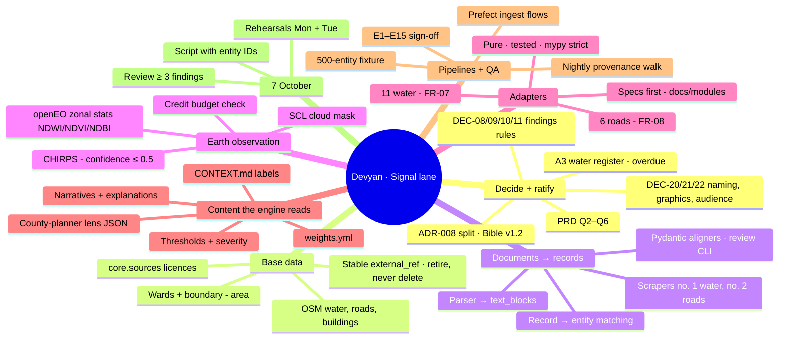
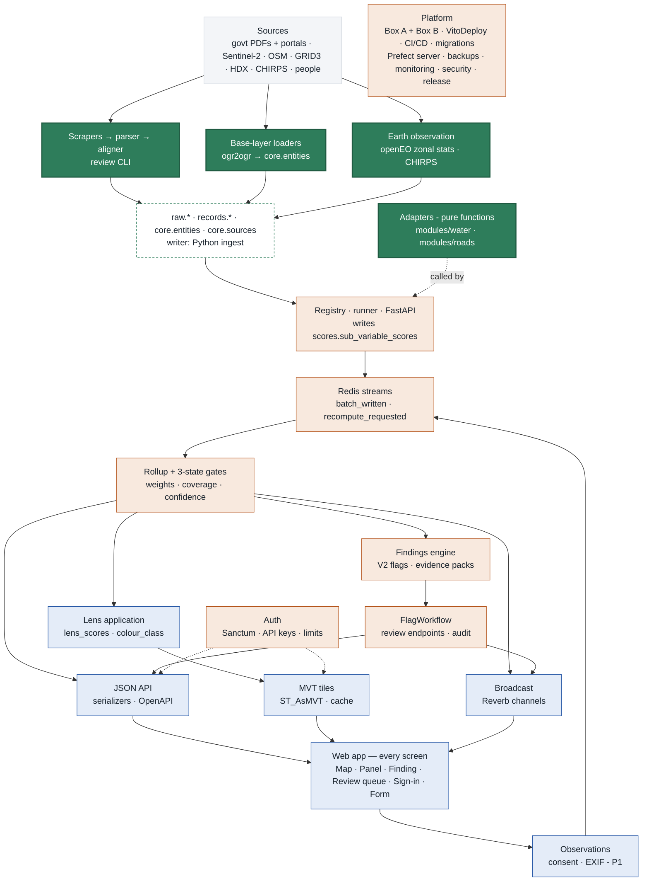
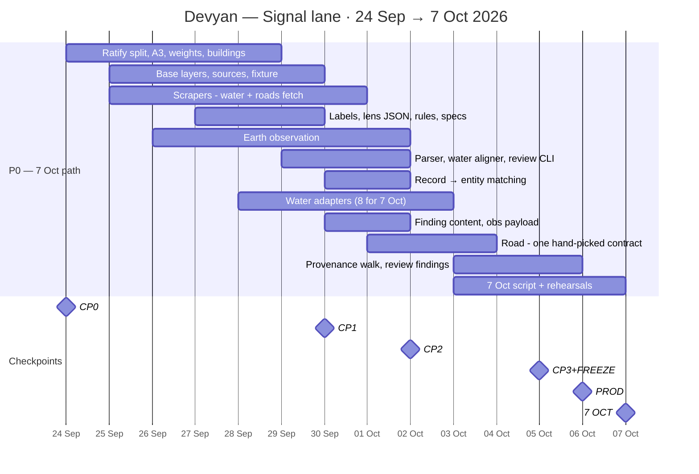
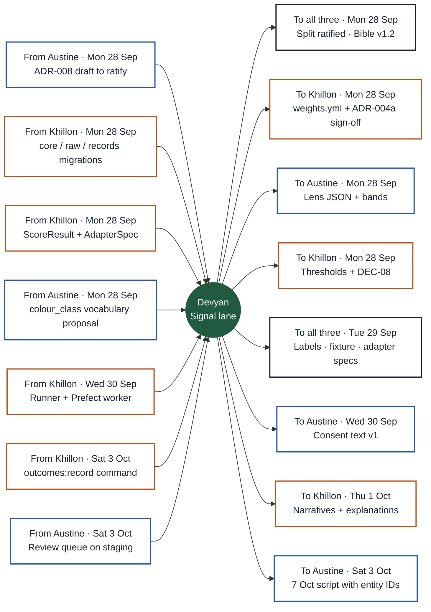

# Navuuna work pack — Devyan
**Signal lane · Founder, CTIPSO** · Split rev 3 · key date 7 Oct · Sun 27 Sep 2026 · Internal

> Everything that turns sources into scores: base layers, scrapers, parsers, aligners, Earth observation, all 17 adapters — plus product decisions and 7 Oct.
>
> **Key date: Wednesday 7 October 2026** — re-dated Sun 27 Sep (was 15 Oct). 10 days to go; the date does not move.
>
> Split binding once Devyan ratifies ADR-008 (Mon 28 Sep). Scope trims are marked **7 Oct trim** / **Moved after 7 Oct** and need Devyan's confirmation (DEC-23).

## The three lanes

| Lane | Person | Scope |
|---|---|---|
| **Signal lane** · **you** | Devyan Jethwa A. — Founder, CTIPSO | Everything that turns sources into scores: base layers, scrapers, parsers, aligners, Earth observation, all 17 adapters — plus product decisions and 7 Oct. |
| **Core lane** | Khillon — CTO (Backend) | Platform and engine: both boxes, CI/CD, database, signal-service runner, rollup, findings workflow, auth, security, release. |
| **Access lane** | Austine — CTO (Frontend) | All frontend (yours alone) plus the backend that serves it: JSON API and serializers, map tiles, lens application, real-time broadcast, observations. |

### Your backend share

- Base-layer loaders into `core.entities`
- Scrapers, parser, aligners, review CLI
- Earth observation (openEO, CHIRPS) → `raw.eo_stats`
- All 17 adapters — FR-07 water (11), FR-08 roads (6)
- Prefect ingest flows + nightly provenance walk

### Your other software work

- Ratify the split; Bible v1.2; A3 register decision
- weights, lens JSON, thresholds, narratives, CONTEXT.md
- Findings review, 7 Oct script, rehearsals, E1–E15 sign-off

### Next 48 hours — Mon 28 and Tue 29 Sep

1. Mon 28: confirm the 7 Oct scope (DEC-23); ratify ADR-008; close the overdue decisions (A3 water list, graphics, audience).
2. Mon 28: commit `weights.yml`, the lens JSON and the finding thresholds.
3. Mon 28 – Tue 29: base layers + sources loaded; fixture exported; hand-checked water list under way.
4. Tue 29: CONTEXT.md labels + adapter specs to Austine and Khillon; first satellite stats row.
5. Wed 30 Sep 16:00 (CP1): first three adapters scoring real water points.

### The seven things to show on 7 Oct (Bible §3.3)

| # | Item | Leads | Supports |
|---|---|---|---|
| 1 | Nairobi map with ≥ 200 water & sanitation entities loaded and scored | **Devyan** | Khillon, Austine |
| 2 | Any entity: five variable scores with coverage, confidence and the sub-variable breakdown | **Khillon** + **Austine** | Devyan |
| 3 | ≥ 3 findings, each with an evidence pack and a visible hold / release state | **Khillon** | Devyan, Austine |
| 4 | One working lens (county planner) that re-colours the map | **Austine** | Devyan |
| 5 | One road segment scored from one hand-picked public contract | **Devyan** | Khillon |
| 6 | A new observation changes the score on screen — live via Reverb, or on refresh (decided Mon 5 Oct) | **Austine** | Khillon |
| 7 | The API returns the same entity as JSON | **Austine** | Khillon |

**How to read this pack.** Sections 1–8 are yours. The appendix is identical in all three packs. Task IDs (A-, K-, D-) become GitHub issue titles (§14.10); Bible v1.1 task numbers are kept in the refs.

**Read from:** Build Bible v1.1 (20 Sep — supersedes the v1.0 copy in the project) · PRD-001 v1.0 (20 Sep) · Proposal v1.0 (18 Sep) · Open Questions (20 Sep — all six closed by v1.1) · Pitch graphics (22 Sep): platform infographic + Parcel Passport

---

## 1 · Your map

---

## 2 · Who owns what — the whole system

Data flows top to bottom. Solid = yours (Signal lane); tinted = a teammate's; dashed = shared store. Colours: green Devyan · orange Khillon · blue Austine.

### What moved compared with Bible v1.1

| Work | Bible v1.1 | This split |
|---|---|---|
| FR-07 / FR-08 adapter code | Devyan spec · Khillon code | Devyan spec **and** code · Khillon reviews |
| JSON endpoints FR-16 (K2.5) | Khillon | Austine — auth, API keys, limits stay Khillon |
| MVT tiles + tile cache (K2.6, K3.2) | Khillon | Austine |
| Lens engine FR-12 (K3.1) | Khillon | Austine (lens content stays Devyan) |
| Reverb events (K3.3) | Khillon | Austine broadcasts · Khillon emits domain events |
| Transition endpoint (K3.4) | Khillon | Khillon, plus `GET /flags` queue endpoint |
| FR-17 observations backend | Austine + Khillon | Austine (P1; 7 Oct fallback command is P0) |
| Prefect flows | Khillon | Devyan writes ingest flows · Khillon runs server/worker + scoring flow |
| API key issuing (Week 4) | Khillon | Khillon, pulled forward to W1 |
| Roads scraper fetch (D3.1) | Devyan, Week 3 | Devyan, pulled forward to W1 |
| Offline laptop fallback | Devyan (Bible) / Austine (PRD R10) | Khillon builds the stack · Austine records video |
| Sprint dates §13 | Weeks 1–4 from 18 Sep | Re-dated Sun 27 Sep: key date Wed 7 Oct (was 15 Oct); CP1 30 Sep · CP2 2 Oct · CP3 5 Oct |

---

## 3 · Your timeline — to 7 October

| Checkpoint | When | Must be true on staging |
|---|---|---|
| **CP0** · Decisions + skeleton | Thu 24 Sep | ADR-002, ADR-004a, ADR-008, ADR-009 · repo + CI green · boxes reachable · basemap local · `weights.yml` in repo — anything still open is due Mon 28 Sep |
| **CP1** · Foundations + first slice | Wed 30 Sep 16:00 | Base layers loaded · one real water entity flows sub-scores → rollup → API → panel on staging |
| **CP2** · Water module | Fri 2 Oct 16:00 | ≥ 200 water entities with ≥ 3 measured sub-variables · ≥ 3 findings held with packs · lens recolours map · panel on real data |
| **CP3** · Built + frozen | Mon 5 Oct 16:00 | All 7 items on staging incl. one road finding and the review path · live update or refresh decided (12:00) · E2E green · data frozen · rehearsal 1 |
| **PROD** · Production | Tue 6 Oct | `v0.1.0` on the production URL · rehearsal 2 · video recorded · offline stack tested |
| **7 OCT** · Key date | Wed 7 Oct | Seven items from Bible §3.3, live, on production |

> **Load check.** Rough sizing (used only to balance the lanes): even after the 7 Oct trims, P0 work is ≈ 15–17 person-days per lane, against 8 weekdays (Mon 28 Sep – Wed 7 Oct) plus two weekend days. The plan only holds with early decisions, weekend work and same-day reviews. If a checkpoint slips, the next cut comes from the risk table — never from the “never cut” list.

---

## 4 · Your tasks

Done means merged to `main`, green, on staging and shown at the next checkpoint (§14.8). Due dates are the latest acceptable day, not a target.

### W0 · now, by Mon 28 Sep · Decisions + skeleton (anything from CP0 still open)

- [ ] **D-01 · Ratify the split** — due **Mon 28 Sep**
  - **Do:** Approve ADR-008 (Austine drafts). Mon 28: Bible v1.2 — §4.1 adapters row, §4.2 owners, §12, §13 (checkpoints in this pack), §17 backlog items from the pitch graphics (DEC-21), §19 change log; PRD §20 engineering line.
  - **Done when:** ADR merged; Bible v1.2 in `docs/`
  - **Needs:** A-02 · **Refs:** §12, §14.9, DEC-01/02
- [ ] **D-02 · A3 — water register (overdue)** — due **Mon 28 Sep**
  - **Do:** Confirm WASREB / Nairobi Water publish a scrapable register with rated yields. If not: county water department documents. If neither by Mon 28 Sep: hand-curate the register for the 200 entities shown on 7 Oct, stored as an uploaded document (hashed, `core.sources` kind `upload`) so provenance holds.
  - **Done when:** Written decision; §18 updated
  - **Needs:** — · **Refs:** A3, PRD R1
- [ ] **D-03 · Commit `weights.yml` v1** — due **Mon 28 Sep**
  - **Do:** Content already fixed in §6.7; file at `services/signals/engine/weights.yml`.
  - **Done when:** File in repo (D1.1)
  - **Needs:** K-01 · **Refs:** §6.7, ADR-007
- [ ] **D-04 · Buildings rule (DEC-07)** — due **Mon 28 Sep**
  - **Do:** OSM buildings load as `parcel` entities with `module=land` (disabled): they count toward FR-01 but stay out of the runner, rollup and default tiles.
  - **Done when:** Rule in `docs/modules/land.md`
  - **Needs:** — · **Refs:** FR-01, NFR-03

### W1 · Mon 28 – Wed 30 Sep · Foundations + first slice (CP1 Wed 30 Sep)

- [ ] **D-05 · Base layers (FR-01)** — due **Mon 28 Sep**
  - **Do:** IEBC/HDX wards + county boundary as `area` (> 80). Geofabrik Kenya → clip to Nairobi → water points (start with amenity=drinking_water, amenity=water_point, man_made=water_well / water_tap / water_tower / water_works / reservoir_covered / wastewater_plant, man_made=storage_tank + content=water, amenity=toilets — check counts before fixing the list), roads as `segment`, buildings per D-04. `external_ref`: `osm:n123`, `osm:w456`, `iebc:ward:<code>`. Idempotent upsert on `external_ref` (stable IDs across reloads); entities missing from a new extract get `retired_at`, never deleted (E15). One `raw.vectors` row per layer.
  - **Done when:** Areas > 80; total entities > 5,000 (D1.2/D1.3)
  - **Needs:** K-06 (Mon 28) · **Refs:** FR-01, FR-02, E15
- [ ] **D-06 · `core.sources`** — due **Mon 28 Sep**
  - **Do:** Every §7.1 source with licence and attribution text — feeds the UI footer and API attribution.
  - **Done when:** Rows exist (D1.4, PRD 15.3)
  - **Needs:** K-06 · **Refs:** NFR-09
- [ ] **D-07 · Scraper base + water scraper #1 (FR-04)** — due **Tue 29 Sep**
  - **Do:** Scrapy for static, Playwright for JS-heavy. MD5 → exit immediately if unchanged; bytes to MinIO; `raw.documents` (url, md5, storage_path, mime, fetched_at, http_status). robots.txt, rate limit, identifying user-agent, never behind a login.
  - **Done when:** ≥ 1 document; re-run exits on unchanged MD5 (D1.5)
  - **Needs:** K-04 MinIO · **Refs:** FR-04, §7.2, §15
- [ ] **D-08 · Scraper #2 roads — fetch + hash** — due **Wed 30 Sep**
  - **Do:** KeNHA / KURA / county contract lists. Pulled forward from Week 3 so W3 is parsing, not discovery.
  - **Done when:** ≥ 1 contract document stored
  - **Needs:** D-07 · **Refs:** FR-04
- [ ] **D-09 · CONTEXT.md + user-facing labels** — due **Tue 29 Sep**
  - **Do:** Apply DEC-20 first (Passport? one name per variable). Glossary: entity, sub-variable, lens, gate, guard, provisional, coverage, confidence, finding. Plus the on-screen label for all 5 variables, all 28 sub-variables and every status (PRD 19.1). Austine renders these verbatim.
  - **Done when:** Merged (D1.7)
  - **Needs:** — · **Refs:** §14.6, PRD 19
- [ ] **D-10 · County-planner lens JSON (DEC-15)** — due **Mon 28 Sep**
  - **Do:** Variable weights (PRD US-302: working .40, record .30, reach .20, inputs .10, momentum 0), direction per variable, bands 80–100 / 60–79 / 40–59 / 0–39, colour_class vocabulary agreed with Austine. Decide the file location (one global lens file vs module `lens.json`).
  - **Done when:** File merged; `lens:sync` loads it
  - **Needs:** A-05 proposal · **Refs:** FR-12, §6.6
- [ ] **D-11 · Findings rules** — due **Mon 28 – Tue 29 Sep**
  - **Do:** DEC-09 thresholds + severity bands per 2.1–2.5 and the E8 auto-resolve threshold; DEC-08 V2 visibility; DEC-10 transition semantics; DEC-11 “X of Y”.
  - **Done when:** Written into ADR / Bible
  - **Needs:** — · **Refs:** FR-10, §6.5
- [ ] **D-12 · Adapter specs — water (D2.3)** — due **Tue 29 Sep**
  - **Do:** `docs/modules/water.md`, one page per FR-07 adapter: signal, `requires` inputs, formula, score anchors (what 0 and 100 mean — direction-neutral but oriented), confidence rule, null conditions with reason strings, E7 / E9 / E10 / E11 handling. 5.1 walking-time method (DEC-16).
  - **Done when:** Merged before any adapter code
  - **Needs:** — · **Refs:** FR-07, PRD R7
- [ ] **D-13 · Earth observation (FR-03)** — due **Tue 29 Sep**
  - **Do:** openEO on CDSE: Sentinel-2 L2A, SCL cloud mask, NDWI / NDVI / NDBI, `aggregate_spatial` over entity buffers (point radius buffered in EPSG:32737; segments buffered) → `raw.eo_stats` (entity_id, product, index_name, value, acquired_at, cloud_pct). Check the monthly credit quota before any archive run (DEC-19); fallback DE Africa products or COG window reads on Box B.
  - **Done when:** ≥ 1 `raw.eo_stats` row (D1.6)
  - **Needs:** D-05 · **Refs:** FR-03, §7.1, R3
- [ ] **D-14 · Local 500-entity fixture** — due **Tue 29 Sep**
  - **Do:** SQL, under 1 MB, includes the 7 Oct entities, no PII — for everyone's local stack.
  - **Done when:** Khillon's compose seeds from it
  - **Needs:** D-05 · **Refs:** §14.11
- [ ] **D-15 · Parser (FR-05)** — due **Tue 29 Sep**
  - **Do:** pdfplumber / pypdf → `raw.text_blocks` (page, block_index, text, bbox). Layout only — no interpretation.
  - **Done when:** Blocks exist for the water register
  - **Needs:** D-07 · **Refs:** FR-05, §7.2

### W2 · Thu 1 – Fri 2 Oct · Water module (CP2 Fri 2 Oct)

- [ ] **D-16 · Water aligner + review CLI** — due **Thu 1 Oct**
  - **Do:** Pydantic `WaterSchemeRecord`; deterministic column mapping; every field tied to a block id; `alignment_confidence`, `aligner_version`. Below 0.6 → `records.review_queue`. CLI to approve / reject queue rows (writes `reviewed_by`, `decision`).
  - **Done when:** ≥ 200 rows; low-confidence rows queued (D2.1)
  - **Needs:** D-15 · **Refs:** FR-05, E6, A9
- [ ] **D-17 · Record → entity matching (D2.2)** — due **Thu 1 Oct**
  - **Do:** Name normalisation + distance. ≥ 80 % matched; unmatched logged, never guessed (E5). Hand-curated match file for the 200 shown on 7 Oct (PRD R2) with provenance.
  - **Done when:** Match rate reported
  - **Needs:** D-16 · **Refs:** E5, PRD R2
- [ ] **D-18 · Water adapters (FR-07)** — due **First 3 Wed 30 Sep · all Fri 2 Oct**
  - **Do:** 11 pure adapters per ADR-003, in value-for-7-Oct order: 1.1, 2.1, 2.2, 2.4, 2.5, 1.2 (findings need these), then 5.2, 4.4, 5.1, 4.1, 1.3. Unit test each: known in → known out, plus every null path. `mypy --strict`. **7 Oct trim (proposed, DEC-23):** 8 adapters for 7 Oct — 1.1, 2.1, 2.2, 2.4, 2.5, 1.2, 5.2, 4.4. 5.1, 4.1 and 1.3 move after 7 Oct.
  - **Done when:** ≥ 200 water entities with ≥ 3 measured sub-variables (D2.4)
  - **Needs:** K-09 interface (Mon 28) · **Refs:** FR-07, §14.6
- [ ] **D-20 · Finding content** — due **Thu 1 Oct**
  - **Do:** Narrative template per 2.x sub-variable (describe the gap, both sources with dates, never cause / intent / person) and the candidate-explanation list per sub-variable type for the review screen (US-401).
  - **Done when:** Files merged; Khillon and Austine consume
  - **Needs:** — · **Refs:** PRD 9.4, US-401
- [ ] **D-21 · Community observation payload v1 (DEC-14)** — due **Thu 1 Oct**
  - **Do:** Fields and which adapters read them: 1.2 from operational / not operational; “does not exist here” lowers 1.1 confidence; E11 — a contradiction lowers confidence and both are kept.
  - **Done when:** Schema in `docs/modules/water.md`
  - **Needs:** — · **Refs:** FR-17, E11
- [ ] **D-22 · Prefect ingest flows** — due **Thu 1 Oct**
  - **Do:** Scrape (daily), parse, align, EO (per revisit), CHIRPS; retries; skip on unchanged hash. **7 Oct trim (proposed, DEC-23):** run ingest scripts by hand, logged, for 7 Oct; scheduled Prefect flows after.
  - **Done when:** Flows run on Box B (D2.5)
  - **Needs:** K-12 · **Refs:** §7.2, NFR-10

### W3 · Sat 3 – Mon 5 Oct · Road, review, real-time, hardening, freeze (CP3 Mon 5 Oct)

- [ ] **D-23 · Roads (FR-08)** — due **Sat 3 Oct**
  - **Do:** Parser / aligner → `records.road_contracts` (≥ 20). Contract segment entities by merging matched OSM ways (`external_ref contract:<agency>:<ref>`). Adapters 1.1, 1.2, 2.2, 2.4, 2.5, 5.2. NDBI change along the segment for 2.4. **Already applied for 7 Oct:** one hand-picked contract and one segment (Bible cut #4).
  - **Done when:** ≥ 1 road finding with evidence on the map (D3.1–D3.3)
  - **Needs:** D-08, D-13 · **Refs:** FR-08
- [ ] **D-24 · Provenance walk (NFR-01)** — due **Sat 3 Oct**
  - **Do:** 20 random scores → `source_ids` → records / eo_stats → text_blocks → documents → MinIO bytes, MD5 re-checked. Nightly Prefect flow on staging; alert on failure. **7 Oct trim (proposed, DEC-23):** one manual walk of 20 scores before the freeze; the nightly flow after 7 Oct.
  - **Done when:** Nightly run green (PRD 15.3)
  - **Needs:** D-22 · **Refs:** NFR-01
- [ ] **D-25 · Review findings + seed outcomes** — due **Mon 5 Oct**
  - **Do:** You are the reviewer — the one non-delegable task. Take ≥ 3 findings through the full path with notes; seed two outcomes with `outcomes:record` (D3.4). **7 Oct trim (proposed, DEC-23):** outcome seeding moves after 7 Oct with K-17; the ≥ 3 reviewed findings stay.
  - **Done when:** PRD 15.1 findings row satisfied
  - **Needs:** A-22, K-14, K-17 · **Refs:** FR-11, FR-19
- [ ] **D-26 · PRD open questions (DEC-17)** — due **per item**
  - **Do:** Q4 cannot_assess on the default map (Wed 30 Sep); Q2 contest email live and monitored + Q6 header name (Fri 2 Oct); Q5 held findings via analyst view on 7 Oct (Sat 3 Oct); Q3 consent text + legal sign-off after 7 Oct (the form moved).
  - **Done when:** Each answer in the channel + PRD §18
  - **Needs:** — · **Refs:** PRD §18

### W4 · Tue 6 – Wed 7 Oct · Production and 7 October

- [ ] **D-27 · 7 October** — due **Sat 3 · Mon 5 · Tue 6 Oct**
  - **Do:** Script for the DEC-22 audience with exact entity IDs (Sat 3 → Austine for E2E and video); attribution text; open-items list; E1–E15 verification sign-off with owners; rehearsal 1 (Mon 5) and 2 (Tue 6).
  - **Done when:** Two clean rehearsals
  - **Needs:** all P0 · **Refs:** PRD §16, 15.5

### After 7 Oct (P1 and moved items — due 31 Oct)

- [ ] **D-19 · CHIRPS → 4.1 (4.2 if time)** `P1` — due **After 7 Oct**
  - **Do:** Sample per entity into `raw.eo_stats`; confidence capped at 0.5; null reason text “area-level only” (E9). **Moved after 7 Oct (proposed, DEC-23):** 4.1 moves with its adapter (D-18).
  - **Done when:** 4.1 measured for the 7 Oct entities
  - **Needs:** D-13 · **Refs:** §6.8 warning, E9
- [ ] **D-28 · Momentum 3.x on areas (FR-18)** `P1` — due **31 Oct**
  - **Do:** 5-year Sentinel-2 archive for area entities. V3 stays `null_not_measured` at points — correct behaviour. Starts only after 7 Oct. **Already applied for 7 Oct:** Momentum stays after 7 Oct.
  - **Done when:** V3 scored for wards
  - **Needs:** D-13 · **Refs:** FR-18

---

## 5 · Handoffs

If a handoff will be late, say so in the 10:00 async on or before its date — not after. Work against stubs, fixtures and the OpenAPI spec meanwhile.

### What you need

| From | By | What |
|---|---|---|
| Austine | Mon 28 Sep | ADR-008 draft to ratify |
| Khillon | Mon 28 Sep | core / raw / records migrations |
| Khillon | Mon 28 Sep | ScoreResult + AdapterSpec |
| Austine | Mon 28 Sep | colour_class vocabulary proposal |
| Khillon | Wed 30 Sep | Runner + Prefect worker |
| Khillon | Sat 3 Oct | `outcomes:record` command |
| Austine | Sat 3 Oct | Review queue on staging |

### What you owe

| To | By | What |
|---|---|---|
| all three | Mon 28 Sep | Split ratified · Bible v1.2 |
| Khillon | Mon 28 Sep | `weights.yml` + ADR-004a sign-off |
| Austine | Mon 28 Sep | Lens JSON + bands |
| Khillon | Mon 28 Sep | Thresholds + DEC-08 |
| all three | Tue 29 Sep | Labels · fixture · adapter specs |
| Austine | Wed 30 Sep | Consent text v1 |
| Khillon | Thu 1 Oct | Narratives + explanations |
| Austine | Sat 3 Oct | 7 Oct script with entity IDs |

---

## 6 · Decisions

### You decide — write it down as an ADR or Bible entry the same day (§12)

| ID | Decision | Owner | Due | Recommendation |
|---|---|---|---|---|
| **DEC-01** | Ratify this three-lane split as ADR-008; update Bible §4.1, §4.2, §12, §19 (v1.2). | Devyan | Mon 28 Sep — overdue if open | Adopt. Austine drafts the ADR. |
| **DEC-02** | Re-baseline §13 to the 7 Oct checkpoints: CP1 Wed 30 Sep, CP2 Fri 2 Oct, CP3 + freeze Mon 5 Oct, production Tue 6 Oct. | Devyan | Mon 28 Sep — overdue if open | Adopt the checkpoint table in this pack. |
| **DEC-07** | Buildings: load as `parcel`, `module=land` (disabled) — out of runner, rollup and default tiles. | Devyan | Mon 28 Sep — overdue if open | Adopt. Keeps rollup under 10 min. |
| **DEC-08** | V2 while a finding is held: gaps under review must not reach viewers via the V2 score, lens colour or tiles. | Devyan | Mon 28 Sep | Rollup excludes 2.x sub-variables with an unpublished finding from the stored V2 row; re-roll on publish/dismiss. |
| **DEC-09** | Finding thresholds + severity bands per 2.1–2.5; E8 auto-resolve threshold. | Devyan | Mon 28 Sep | Needed before the findings engine. |
| **DEC-10** | PRD buttons (Publish / Dismiss / Needs more evidence) vs Bible lifecycle (explanation_checked step). | Devyan | Tue 29 Sep | One request records held → explanation_checked (+ explanation) → published/dismissed with the same note. Needs more evidence = stays held, note-only audit event. |
| **DEC-11** | “X of Y” definition. PRD mock shows “4 of 6” on Activity, but V1 has 4 contributors. | Devyan | Tue 29 Sep | Y = all weighted contributors (V1 4 · V2 4 · V3 6 · V4 6 · V5 6); gates/guard excluded. Fix the mock. |
| **DEC-14** | Community observation payload v1 and which adapters read it. | Devyan | Thu 1 Oct | 1.2 from operational/not; “does not exist here” lowers 1.1 confidence; E11 rule. |
| **DEC-15** | County-planner lens: file location, weights, direction, bands, colour_class vocabulary. | Devyan | Mon 28 Sep | Weights V1 .40 · V2 .30 · V3 0 · V4 .10 · V5 .20 (PRD US-302); bands 80/60/40; classes b1–b4, `p` hatch, `ca`. |
| **DEC-16** | 5.1 walking-time method for v1. | Devyan | Tue 29 Sep | Decide in the 5.1 spec; cap confidence if not network-routed. |
| **DEC-17** | PRD Q2–Q6: cannot_assess on map (Wed 30 Sep), contest email + header name (Fri 2 Oct), held findings via analyst view on 7 Oct (Sat 3 Oct); consent text + legal after 7 Oct (the form moved). | Devyan | per item | Follow PRD recommendations on Q4 and Q5. |
| **DEC-19** | openEO monthly credit budget vs archive runs. | Devyan | Tue 29 Sep | Check quota in the CDSE dashboard; fallback DE Africa / COG reads on Box B. |
| **DEC-20** | Vocabulary from the pitch graphics: does “Passport” name the entity panel for all four entity types? One on-screen name per variable (Index Stack names map 1:1 or are dropped). | Devyan | Tue 29 Sep | One name per concept (§14.6). “Passport” works for every entity type if it drops “Parcel”; retire SMI and ECI as names. |
| **DEC-21** | Status of the 22 Sep pitch graphics. | Devyan | Mon 28 Sep — overdue if open | Pitch + roadmap only. Log multi-module Parcel Passport, Scenario Engine, SMI and the Energy stamp in Bible §17. Apply the A7 fix list before external use. |
| **DEC-22** | Audience for 7 Oct: county planner (Bible) or investor framing (graphics). | Devyan | Mon 28 Sep | County planner for 7 Oct — matches the lens, persona and grant path; show investor framing as roadmap. |
| **DEC-23** | Key date moved to Wed 7 Oct: confirm the trimmed scope — tasks marked “7 Oct trim” and those moved after 7 Oct. | Devyan | Mon 28 Sep | Confirm, or tell each owner which trim to reverse and what to drop instead. |

### You are waiting on — chase on the due date; build against the recommendation meanwhile

| ID | Decision | Owner | Due | Recommendation |
|---|---|---|---|---|
| **DEC-03** | ADR-002: Vue 3 or React (was due 22 Sep). | Austine | Mon 28 Sep — overdue if open | Pick the one you ship fastest in. PRD R8: if undecided, Devyan picks. |
| **DEC-05** | ADR-004a: table-level writer matrix, DB role GRANTs, Redis stream contracts, reconciliation sweep. | Khillon | Mon 28 Sep — overdue if open | Adopt appendix matrix. Devyan signs. |
| **DEC-12** | Honest tiles: `lens.lens_scores` has no coverage/confidence; tiles carry no confidence or name, yet PRD tooltip shows name + score. | Austine | Tue 29 Sep | Add coverage + confidence columns; add `confidence` (and `name` at z ≥ 14) to tile properties. ADR-005 amendment. |
| **DEC-13** | §11 gaps: no queue endpoint, no sign-in/`me`, no withdraw, one WS channel per entity only. | Austine | Tue 29 Sep | Add `GET /flags?state=`, `GET /me`, sign-in/out, `POST /observations/{id}/withdraw`, WS `map` + `review`. |

---

## 7 · Edge cases, tests and release criteria you own

### PRD §11 edge cases — your part

| Case | What you implement |
|---|---|
| **E4** | OSM-only entity: V2 null with “No official record found” |
| **E5** | Unmatched record stays in the queue — never guessed |
| **E6** | Alignment < 0.6 → review queue, never a score |
| **E7** | Most recent record feeds the score; both kept |
| **E9** | CHIRPS-only → confidence 0.5, “area-level only” |
| **E10** | Missing OSM attribute → null, never a default |
| **E11** | Community vs satellite → lower confidence, keep both |
| **E15** | Missing from a new extract → retired_at, not deleted |

### Tests you write (§14.7)

- [ ] Every adapter: known observation → known score, plus every null path
- [ ] Pydantic schemas for each record type
- [ ] Scraper → parser → aligner on a fixture PDF (integration)
- [ ] Loader idempotency: re-run keeps IDs; missing features retired
- [ ] Nightly provenance walk of 20 random scores

### Release criteria you sign (PRD §15)

- [ ] 15.1 ≥ 200 water entities · ≥ 80 wards · ≥ 1 road segment · ≥ 3 findings published
- [ ] 15.2 E1–E15 verified and documented · no P0/P1 open (you triage)
- [ ] 15.3 Provenance walk on 20 scores · licence + attribution for every source
- [ ] 15.4 Consent text final + versioned · contest email live and monitored
- [ ] 15.5 Two full rehearsals without a blocker

---

## 8 · Reviews you do, risks you watch

### You are the named reviewer for

Review within 24 h; the author never approves their own PR.

- All of `apps/web/**` for PRD conformance (Austine)
- Engine, findings, auth in `apps/api` for §6 rules (Khillon)
- `services/signals/engine/**` and the scoring flow (Khillon)

### Risks and dated cut triggers

| Risk | Response / trigger |
|---|---|
| **R1 — register not scrapable** | Hand-curated register decision by Mon 28 Sep (D-02). |
| **R2 — matching messier than expected** | Hand-curated matches for 7 Oct; real matcher in v1.1. |
| **R3 — cloud leaves many entities provisional** | Use the full archive; if > 40 % provisional, say so on 7 Oct. |
| **openEO credits run out** | Quota check before archive runs; DE Africa or COG reads on Box B. |
| **R7 — you are the bottleneck** | All decisions due Mon 28 – Tue 29 Sep; specs before code; review is your only non-delegable task. |
| **Roads slip** | Already applied: one hand-picked contract + one segment (Bible cut #4). |
| **Pitch graphics overclaim to a county or donor** | Apply the A7 fix list before any external use (DEC-21). |
| **Eight working days is not enough for the full P0** | Trims proposed in DEC-23 (Mon 28 Sep); weekend work Sat 3 – Sun 4 Oct; any further cut is agreed at the next checkpoint. |

> **Cut order for 7 Oct:** FR-17 form and FR-18 Momentum already moved after 7 Oct · roads already one hand-picked contract · FR-15 live update → page refresh, decided Mon 5 Oct 12:00. **Never cut:** coverage and confidence display, evidence packs, the held state, the provisional badge.

---

## Appendix — shared by all three packs

### A1 · Team matrix

O owns · R reviews · C supplies content or is consulted

| Work | Devyan | Khillon | Austine |
|---|---|---|---|
| Scrapers, parser, aligners, review CLI | **O** | **C** | **R** |
| Base-layer loaders (FR-01) | **O** | **C** | **R** |
| Earth observation (openEO, CHIRPS) | **O** |  | **R** |
| Adapters FR-07 / FR-08 + specs | **O** | **R** |  |
| Prefect ingest flows | **O** | **R** |  |
| weights, lens JSON, thresholds, narratives, labels | **O** | **C** | **C** |
| Nightly provenance walk (NFR-01) | **O** | **R** |  |
| Signal service: interface, registry, runner | **R** | **O** |  |
| Migrations, schemas, grants, UUIDv7 | **C** | **O** | **R** |
| Rollup engine + 3-state gates | **R** | **O** |  |
| Findings engine, FlagWorkflow, review endpoints, audit | **R** | **O** | **C** |
| Auth: Sanctum, roles, API keys, limits |  | **O** | **R** |
| Boxes, CI/CD, backups, monitoring, security |  | **O** | **R** |
| Freeze, offline stack, production deploy | **C** | **O** | **C** |
| JSON API, serializers, OpenAPI |  | **R** | **O** |
| MVT tiles + cache |  | **R** | **O** |
| Lens application | **C** | **R** | **O** |
| Broadcast layer + Echo client |  | **R** | **O** |
| Observations, consent, EXIF (P1) | **C** | **R** | **O** |
| All screens S1–S8 (frontend is Austine only) | **R** |  | **O** |
| Playwright E2E, NFR-03 timing, video |  |  | **O** |
| 7 Oct script, rehearsals, E1–E15 sign-off | **O** | **C** | **C** |

### A2 · Review map — becomes `.github/CODEOWNERS`

| Path | Author | Required reviewer |
|---|---|---|
| `apps/web/**` | Austine | Devyan (PRD conformance) |
| `apps/api` Http, Resources, Tiles, Lens, Broadcasting, Observations | Austine | Khillon |
| `apps/api` Engine, Findings, Auth, Audit, Consumers | Khillon | Devyan (§6 rules) |
| `apps/api/database/migrations/**` | anyone | Khillon approves · Austine reviews |
| `services/signals/engine/**`, `services/flows/score_*` | Khillon | Devyan |
| `services/signals/modules/**` | Devyan | Khillon |
| `services/ingest/**`, `data/**`, `services/flows/ingest_*` | Devyan | Austine (Khillon for DB writes) |
| `infra/**`, `.github/**` | Khillon | Austine |
| `docs/CONTEXT.md`, `docs/modules/**` | Devyan | Austine |
| `docs/adr/**` | decider | all three where §14.9 requires |

### A3 · Who writes which table — proposed ADR-004a

| Tables | Only writer | DB role |
|---|---|---|
| `raw.documents`, `raw.text_blocks`, `raw.eo_stats`, `raw.vectors` | Python ingest (Devyan) | `nv_ingest` |
| `records.water_schemes`, `records.road_contracts`, `records.review_queue` | Python ingest — aligner + review CLI | `nv_ingest` |
| `core.entities`, `core.sources` | Python ingest — data loaders | `nv_ingest` |
| `core.adapters`, `scores.sub_variable_scores` | Python signals — registry + runner (Khillon) | `nv_signals` |
| `core.observations`, `core.consents` | Laravel — observations (Austine) | `nv_app` |
| `scores.variable_scores` | Laravel — rollup (Khillon) | `nv_app` |
| `flags.*`, `audit.events` | Laravel — findings + audit (Khillon) | `nv_app` |
| `lens.lenses`, `lens.lens_scores` | Laravel — lens application (Austine) | `nv_app` |
| users, api keys, sessions, jobs, cache | Laravel — auth (Khillon) | `nv_app` |

Why an amendment: Bible §10.1 lists `core.*` and `records.*` as Laravel-written, but the aligner (§7.2), the loaders (FR-01, D1.3–D1.4) and the adapter registry (§4.4) are Python. One writer per table still holds; GRANTs make it enforced, not a convention.

### A4 · Decision register — all three lanes

| ID | Decision | Owner | Due | Recommendation |
|---|---|---|---|---|
| **DEC-01** | Ratify this three-lane split as ADR-008; update Bible §4.1, §4.2, §12, §19 (v1.2). | Devyan | Mon 28 Sep — overdue if open | Adopt. Austine drafts the ADR. |
| **DEC-02** | Re-baseline §13 to the 7 Oct checkpoints: CP1 Wed 30 Sep, CP2 Fri 2 Oct, CP3 + freeze Mon 5 Oct, production Tue 6 Oct. | Devyan | Mon 28 Sep — overdue if open | Adopt the checkpoint table in this pack. |
| **DEC-03** | ADR-002: Vue 3 or React (was due 22 Sep). | Austine | Mon 28 Sep — overdue if open | Pick the one you ship fastest in. PRD R8: if undecided, Devyan picks. |
| **DEC-04** | ADR-009: Laravel 13, not 11. Laravel 11 security fixes ended 12 Mar 2026; 13 runs on PHP 8.3. | Khillon | Mon 28 Sep — overdue if open | Laravel 13. PHP pin unchanged. |
| **DEC-05** | ADR-004a: table-level writer matrix, DB role GRANTs, Redis stream contracts, reconciliation sweep. | Khillon | Mon 28 Sep — overdue if open | Adopt appendix matrix. Devyan signs. |
| **DEC-06** | Migration hygiene: add `raw` to `search_path` (§14.12 lists six), framework-table schema, UUIDv7 DB default, env-driven module flags. | Khillon | Mon 28 Sep — overdue if open | All four in migration 0001–0003. |
| **DEC-07** | Buildings: load as `parcel`, `module=land` (disabled) — out of runner, rollup and default tiles. | Devyan | Mon 28 Sep — overdue if open | Adopt. Keeps rollup under 10 min. |
| **DEC-08** | V2 while a finding is held: gaps under review must not reach viewers via the V2 score, lens colour or tiles. | Devyan | Mon 28 Sep | Rollup excludes 2.x sub-variables with an unpublished finding from the stored V2 row; re-roll on publish/dismiss. |
| **DEC-09** | Finding thresholds + severity bands per 2.1–2.5; E8 auto-resolve threshold. | Devyan | Mon 28 Sep | Needed before the findings engine. |
| **DEC-10** | PRD buttons (Publish / Dismiss / Needs more evidence) vs Bible lifecycle (explanation_checked step). | Devyan | Tue 29 Sep | One request records held → explanation_checked (+ explanation) → published/dismissed with the same note. Needs more evidence = stays held, note-only audit event. |
| **DEC-11** | “X of Y” definition. PRD mock shows “4 of 6” on Activity, but V1 has 4 contributors. | Devyan | Tue 29 Sep | Y = all weighted contributors (V1 4 · V2 4 · V3 6 · V4 6 · V5 6); gates/guard excluded. Fix the mock. |
| **DEC-12** | Honest tiles: `lens.lens_scores` has no coverage/confidence; tiles carry no confidence or name, yet PRD tooltip shows name + score. | Austine | Tue 29 Sep | Add coverage + confidence columns; add `confidence` (and `name` at z ≥ 14) to tile properties. ADR-005 amendment. |
| **DEC-13** | §11 gaps: no queue endpoint, no sign-in/`me`, no withdraw, one WS channel per entity only. | Austine | Tue 29 Sep | Add `GET /flags?state=`, `GET /me`, sign-in/out, `POST /observations/{id}/withdraw`, WS `map` + `review`. |
| **DEC-14** | Community observation payload v1 and which adapters read it. | Devyan | Thu 1 Oct | 1.2 from operational/not; “does not exist here” lowers 1.1 confidence; E11 rule. |
| **DEC-15** | County-planner lens: file location, weights, direction, bands, colour_class vocabulary. | Devyan | Mon 28 Sep | Weights V1 .40 · V2 .30 · V3 0 · V4 .10 · V5 .20 (PRD US-302); bands 80/60/40; classes b1–b4, `p` hatch, `ca`. |
| **DEC-16** | 5.1 walking-time method for v1. | Devyan | Tue 29 Sep | Decide in the 5.1 spec; cap confidence if not network-routed. |
| **DEC-17** | PRD Q2–Q6: cannot_assess on map (Wed 30 Sep), contest email + header name (Fri 2 Oct), held findings via analyst view on 7 Oct (Sat 3 Oct); consent text + legal after 7 Oct (the form moved). | Devyan | per item | Follow PRD recommendations on Q4 and Q5. |
| **DEC-18** | Prefect 2.x (as locked) vs 3.x. | Khillon | Mon 28 Sep — overdue if open | Decide before the first flow is written. |
| **DEC-19** | openEO monthly credit budget vs archive runs. | Devyan | Tue 29 Sep | Check quota in the CDSE dashboard; fallback DE Africa / COG reads on Box B. |
| **DEC-20** | Vocabulary from the pitch graphics: does “Passport” name the entity panel for all four entity types? One on-screen name per variable (Index Stack names map 1:1 or are dropped). | Devyan | Tue 29 Sep | One name per concept (§14.6). “Passport” works for every entity type if it drops “Parcel”; retire SMI and ECI as names. |
| **DEC-21** | Status of the 22 Sep pitch graphics. | Devyan | Mon 28 Sep — overdue if open | Pitch + roadmap only. Log multi-module Parcel Passport, Scenario Engine, SMI and the Energy stamp in Bible §17. Apply the A7 fix list before external use. |
| **DEC-22** | Audience for 7 Oct: county planner (Bible) or investor framing (graphics). | Devyan | Mon 28 Sep | County planner for 7 Oct — matches the lens, persona and grant path; show investor framing as roadmap. |
| **DEC-23** | Key date moved to Wed 7 Oct: confirm the trimmed scope — tasks marked “7 Oct trim” and those moved after 7 Oct. | Devyan | Mon 28 Sep | Confirm, or tell each owner which trim to reverse and what to drop instead. |

### A5 · Rhythm

| When | What |
|---|---|
| Mon 28 Sep 09:00 | 30 min — confirm the 7 Oct scope (DEC-23) and each person's deliverables to CP1 |
| Daily 10:00 | Async: yesterday / today / blocked — blockers raised the same morning |
| 16:00 checkpoints | Wed 30 Sep (CP1) · Fri 2 Oct (CP2) · Mon 5 Oct (CP3 + freeze) — on staging, not slides |
| Tue 6 Oct | Production deploy · rehearsal 2 · video |
| Any PR | Review within 12 h (proposed; was 24 h) — the calendar cannot absorb a day's wait |

### A6 · Rules that still apply to every PR (Bible §6, §14, PRD §10)

- Branch `type/scope-description`, merged within 3 days; squash-merge; Conventional Commits naming the FR or sub-variable ID.
- PR ≤ 400 changed lines. Author never approves their own PR. Review within 24 h.
- Unmeasured = `null_not_measured` with a reason. Never 0. Never a default.
- No score anywhere — API, tile, tooltip, panel — without coverage and confidence beside it.
- No held finding in front of a non-analyst in any form: no row, no count, no placeholder, no colour.
- No new sub-variables. No sub-variable weights in a lens. Weight changes need an ADR.
- Names come from `CONTEXT.md`; user-facing words from PRD §10 and §19.1.
- No TODOs in `main`. No secrets. No data files over 1 MB.

### A7 · Pitch graphics (22 Sep) mapped to Bible v1.1

Vision, not 7 Oct scope — requirements are frozen until 7 Oct (§1).

| In the graphics | Bible v1.1 equivalent | On 7 Oct? |
|---|---|---|
| Parcel Passport (ID, boundary, evidence, history) | Scored entity + provenance + score history | Yes — as the entity panel, for water points |
| Stamps: Land · Roads · Water · Energy | Modules (Layer 1 adapters) | Water + one road. Land = FR-21 (C); Energy = Phase 2 |
| Cross-cutting variables | V1, V2, V4, V5 | Yes |
| Growth Momentum | V3 | Mostly not measured at points — correct |
| Data Freshness | 2.5 Record staleness + “last observed” (not a variable) | Yes, as “last observed” |
| Decision Intelligence column | Lenses (Layer 4) | One lens: county planner |
| Field & survey data | Community observations (FR-17) | Simulated only |
| State / Momentum engines | Rollup of V1 / V3 | Yes — weighted rollup, not ML |
| Scenario Engine | Nothing | No — backlog (DEC-21) |
| “Later stamps inherit confidence” | Only the 1.1 gate: provisional × 0.5 | Partly |
| Index Stack: PSI · CXI · RSI · GMI · DODI · ECI · SMI | V1 · V5 · V4 · V3 · V2 (a finding, not a number) · confidence · none (6th variable → ADR) | Names decided in DEC-20 |

**Fix before the graphics go to a county or donor (DEC-21)**

- [ ] Example parcel at -1.2920, 36.8215 is central Nairobi CBD — use a real peri-urban location or label it illustrative.
- [ ] Scenario percentages (+40 % water security, +25 % parcel value) have no model or confidence behind them; the value figure is a valuation claim. Mark illustrative or remove.
- [ ] “AI-powered … AI & ML models” overclaims: v1 is a transparent weighted rollup and the LLM is off the 7 Oct path. Say “explainable spatial-temporal scoring”.
- [ ] Signature bars and stamps show no coverage (NFR-02).
- [ ] “Record Alignment 67” shows V2 as a bare number; V2 is a finding with evidence, and held findings stay hidden (§6.6, §15).
- [ ] “Missing data lowers confidence” → it lowers **coverage** and is shown as “not measured”.
- [ ] Water Security and Resource Security side by side double-count.
- [ ] “Asset” is used throughout; Bible §6.1 bans it (use “scored entity”).
- [ ] Stamp order Land → Roads → Water → Energy vs build order Water → Roads → Land → Energy.
- [ ] Audience: the graphics pitch investors; the Bible's working first customer is a county via grant (DEC-22).

