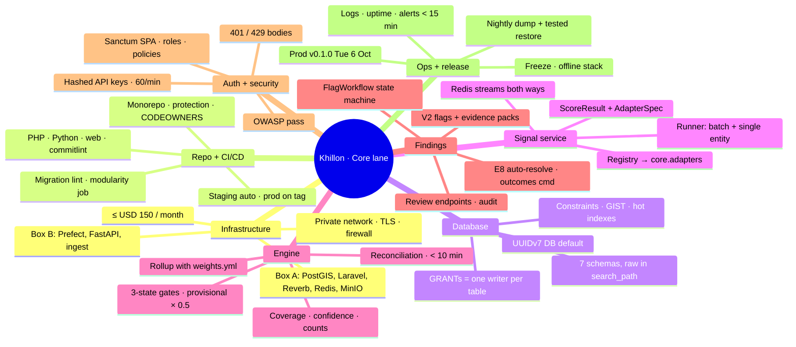
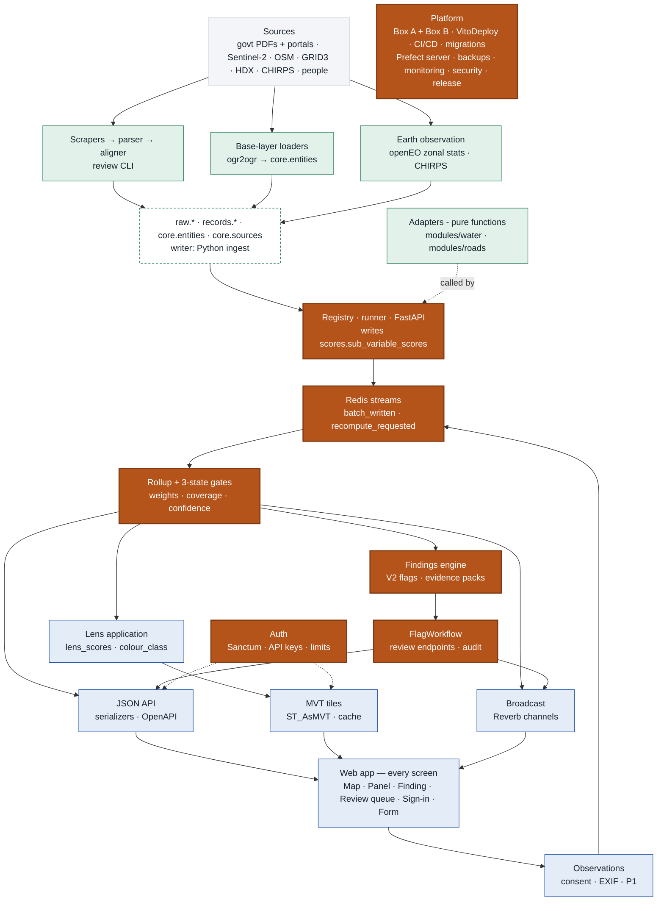
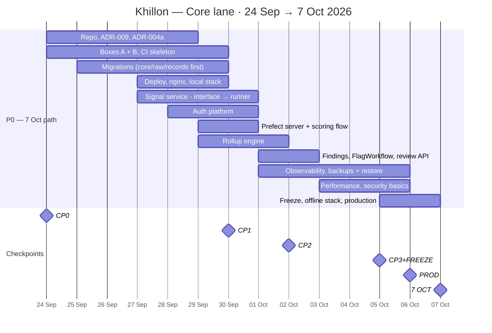
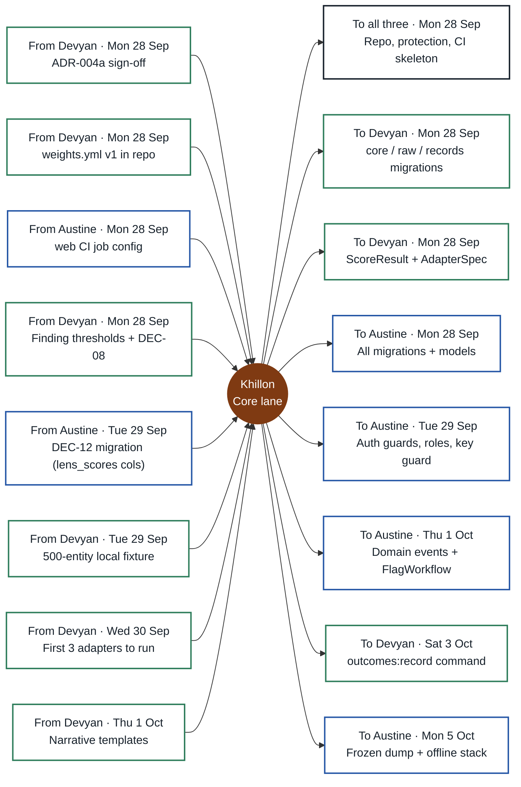

# Navuuna work pack — Khillon
**Core lane · CTO (Backend)** · Split rev 3 · key date 7 Oct · Sun 27 Sep 2026 · Internal

> Platform and engine: both boxes, CI/CD, database, signal-service runner, rollup, findings workflow, auth, security, release.
>
> **Key date: Wednesday 7 October 2026** — re-dated Sun 27 Sep (was 15 Oct). 10 days to go; the date does not move.
>
> Split binding once Devyan ratifies ADR-008 (Mon 28 Sep). Scope trims are marked **7 Oct trim** / **Moved after 7 Oct** and need Devyan's confirmation (DEC-23).

## The three lanes

| Lane | Person | Scope |
|---|---|---|
| **Signal lane** | Devyan Jethwa A. — Founder, CTIPSO | Everything that turns sources into scores: base layers, scrapers, parsers, aligners, Earth observation, all 17 adapters — plus product decisions and 7 Oct. |
| **Core lane** · **you** | Khillon — CTO (Backend) | Platform and engine: both boxes, CI/CD, database, signal-service runner, rollup, findings workflow, auth, security, release. |
| **Access lane** | Austine — CTO (Frontend) | All frontend (yours alone) plus the backend that serves it: JSON API and serializers, map tiles, lens application, real-time broadcast, observations. |

### Your backend share

- Signal service: adapter interface, registry, runner
- Rollup engine: weights, coverage, three-state gates
- Findings engine, FlagWorkflow, review endpoints, audit
- Auth platform: Sanctum, roles, API keys, rate limits
- Migrations, schemas, role GRANTs, Redis streams

### Your other software work

- Both boxes, VitoDeploy, CI/CD, local stack
- Backups + tested restore, monitoring, security pass
- Freeze, offline stack, production deploy

### Next 48 hours — Mon 28 and Tue 29 Sep

1. Mon 28: close anything still open from CP0 — ADR-009, ADR-004a, repo protection, both boxes.
2. Mon 28: `core`, `raw`, `records` migrations + ScoreResult / AdapterSpec so Devyan can load and code.
3. Tue 29: all migrations, auth guards, staging deploy + nginx for Austine.
4. Tue 29: runner and rollup skeleton; Prefect worker up.
5. Wed 30 Sep 16:00 (CP1): one real water entity rolled up and served on staging.

### The seven things to show on 7 Oct (Bible §3.3)

| # | Item | Leads | Supports |
|---|---|---|---|
| 1 | Nairobi map with ≥ 200 water & sanitation entities loaded and scored | **Devyan** | Khillon, Austine |
| 2 | Any entity: five variable scores with coverage, confidence and the sub-variable breakdown | **Khillon** + **Austine** | Devyan |
| 3 | ≥ 3 findings, each with an evidence pack and a visible hold / release state | **Khillon** | Devyan, Austine |
| 4 | One working lens (county planner) that re-colours the map | **Austine** | Devyan |
| 5 | One road segment scored from one hand-picked public contract | **Devyan** | Khillon |
| 6 | A new observation changes the score on screen — live via Reverb, or on refresh (decided Mon 5 Oct) | **Austine** | Khillon |
| 7 | The API returns the same entity as JSON | **Austine** | Khillon |

**How to read this pack.** Sections 1–8 are yours. The appendix is identical in all three packs. Task IDs (A-, K-, D-) become GitHub issue titles (§14.10); Bible v1.1 task numbers are kept in the refs.

**Read from:** Build Bible v1.1 (20 Sep — supersedes the v1.0 copy in the project) · PRD-001 v1.0 (20 Sep) · Proposal v1.0 (18 Sep) · Open Questions (20 Sep — all six closed by v1.1) · Pitch graphics (22 Sep): platform infographic + Parcel Passport

---

## 1 · Your map

---

## 2 · Who owns what — the whole system

Data flows top to bottom. Solid = yours (Core lane); tinted = a teammate's; dashed = shared store. Colours: green Devyan · orange Khillon · blue Austine.

### What moved compared with Bible v1.1

| Work | Bible v1.1 | This split |
|---|---|---|
| FR-07 / FR-08 adapter code | Devyan spec · Khillon code | Devyan spec **and** code · Khillon reviews |
| JSON endpoints FR-16 (K2.5) | Khillon | Austine — auth, API keys, limits stay Khillon |
| MVT tiles + tile cache (K2.6, K3.2) | Khillon | Austine |
| Lens engine FR-12 (K3.1) | Khillon | Austine (lens content stays Devyan) |
| Reverb events (K3.3) | Khillon | Austine broadcasts · Khillon emits domain events |
| Transition endpoint (K3.4) | Khillon | Khillon, plus `GET /flags` queue endpoint |
| FR-17 observations backend | Austine + Khillon | Austine (P1; 7 Oct fallback command is P0) |
| Prefect flows | Khillon | Devyan writes ingest flows · Khillon runs server/worker + scoring flow |
| API key issuing (Week 4) | Khillon | Khillon, pulled forward to W1 |
| Roads scraper fetch (D3.1) | Devyan, Week 3 | Devyan, pulled forward to W1 |
| Offline laptop fallback | Devyan (Bible) / Austine (PRD R10) | Khillon builds the stack · Austine records video |
| Sprint dates §13 | Weeks 1–4 from 18 Sep | Re-dated Sun 27 Sep: key date Wed 7 Oct (was 15 Oct); CP1 30 Sep · CP2 2 Oct · CP3 5 Oct |

---

## 3 · Your timeline — to 7 October

| Checkpoint | When | Must be true on staging |
|---|---|---|
| **CP0** · Decisions + skeleton | Thu 24 Sep | ADR-002, ADR-004a, ADR-008, ADR-009 · repo + CI green · boxes reachable · basemap local · `weights.yml` in repo — anything still open is due Mon 28 Sep |
| **CP1** · Foundations + first slice | Wed 30 Sep 16:00 | Base layers loaded · one real water entity flows sub-scores → rollup → API → panel on staging |
| **CP2** · Water module | Fri 2 Oct 16:00 | ≥ 200 water entities with ≥ 3 measured sub-variables · ≥ 3 findings held with packs · lens recolours map · panel on real data |
| **CP3** · Built + frozen | Mon 5 Oct 16:00 | All 7 items on staging incl. one road finding and the review path · live update or refresh decided (12:00) · E2E green · data frozen · rehearsal 1 |
| **PROD** · Production | Tue 6 Oct | `v0.1.0` on the production URL · rehearsal 2 · video recorded · offline stack tested |
| **7 OCT** · Key date | Wed 7 Oct | Seven items from Bible §3.3, live, on production |

> **Load check.** Rough sizing (used only to balance the lanes): even after the 7 Oct trims, P0 work is ≈ 15–17 person-days per lane, against 8 weekdays (Mon 28 Sep – Wed 7 Oct) plus two weekend days. The plan only holds with early decisions, weekend work and same-day reviews. If a checkpoint slips, the next cut comes from the risk table — never from the “never cut” list.

---

## 4 · Your tasks

Done means merged to `main`, green, on staging and shown at the next checkpoint (§14.8). Due dates are the latest acceptable day, not a target.

### W0 · now, by Mon 28 Sep · Decisions + skeleton (anything from CP0 still open)

- [ ] **K-01 · Monorepo + governance** — due **Mon 28 Sep**
  - **Do:** `github.com/navuuna/navuuna` per §14.1. Branch protection: 1 approval, CI green, no direct push, squash-merge only. PR template (v1.1 checklist), issue templates, labels `module:*`, `layer:*`, `pri:*`, `owner:*`. CODEOWNERS from the review map in this pack. commitlint + pre-commit (Pint, ruff, eslint/prettier).
  - **Done when:** First PR merges with CI green (K1.1)
  - **Needs:** — · **Refs:** ADR-001
- [ ] **K-02 · ADR-009 — Laravel 13** — due **Mon 28 Sep**
  - **Do:** Laravel 11 security fixes ended 12 Mar 2026; a new codebase should not start unpatched. Laravel 13 is current and runs on PHP 8.3, so the PHP pin stays. Sanctum, Reverb and queues are first-party in 13.
  - **Done when:** ADR merged before `laravel new`
  - **Needs:** — · **Refs:** §8.1
- [ ] **K-03 · ADR-004a — writers, GRANTs, streams** — due **Mon 28 Sep**
  - **Do:** Table-level writer matrix (appendix). Three Postgres roles `nv_ingest`, `nv_signals`, `nv_app` with INSERT/UPDATE only on their tables. Redis Streams: `signals.batch_written` {batch_id, entity_ids[], module, adapter_versions, written_at} and `signals.recompute_requested` {entity_id, reason, requested_by, requested_at}; consumer groups + ack. Reconciliation sweep every 10 min: roll up any entity whose newest sub-score is newer than its newest variable score (a lost event can never leave stale scores).
  - **Done when:** ADR merged; Devyan signs
  - **Needs:** Devyan sign-off · **Refs:** ADR-004, §4.3
- [ ] **K-04 · Box A + Box B** — due **Mon 28 Sep**
  - **Do:** If not yet ordered, order first thing Mon 28 Sep. A (8 GB / 4 vCPU / NVMe): PostgreSQL 16 + PostGIS 3.4, Laravel, Reverb, Redis, MinIO. B (16 GB / 8 vCPU / large disk): Prefect server + worker, Docker Compose for FastAPI and ingest. VitoDeploy on both; private network; Postgres and Redis bound to the private interface; Redis password/ACL; ufw, SSH keys only, fail2ban; TLS on `staging.navuuna.*`; install `postgresql-16-postgis-3` if VitoDeploy does not.
  - **Done when:** SSH + `psql` from B to A (K1.3)
  - **Needs:** — · **Refs:** ADR-006, NFR-11
- [ ] **K-05 · CI** — due **Mon 28 (skeleton) · Tue 29 Sep (all)**
  - **Do:** Jobs: `php` (Pint, PHPStan L6, Pest with a PostGIS service container), `python` (ruff, `mypy --strict` on engine + modules, pytest), `web` (Austine's config), `commitlint`, migration lint (empty `down()` or unqualified `Schema::create` fails), modularity (delete `modules/roads` → build + tests pass), secret scan (gitleaks).
  - **Done when:** `ci.yml` green on a trivial PR
  - **Needs:** — · **Refs:** K1.2, §14.7, NFR-07

### W1 · Mon 28 – Wed 30 Sep · Foundations + first slice (CP1 Wed 30 Sep)

- [ ] **K-06 · Migrations + models** — due **Mon 28 Sep (core/raw/records) · Tue 29 Sep (rest)**
  - **Do:** `0001_create_schemas`: all seven, `search_path` including `raw` (§14.12 lists six); PostGIS in `public`; framework tables placed per ADR-004a. UUIDv7 as a DB column default via a SQL function — PG16 has no native `uuidv7()` — so PHP and Python agree. All §10 tables incl. `status`, `gate_status`, `weight_version`. CHECKs: entity_type ↔ geometry type, `radius_m` for points, SRID 4326, score 0–100, confidence 0–1, measured ⇔ score present, null ⇔ `null_reason`. Unique `external_ref` (FR-02 stable IDs). GIST on every geometry. Hot-path indexes: sub scores (entity, sub_id, computed_at desc), variable scores (entity, variable, computed_at desc), lens_scores (lens, entity), flags (state, detected_at). Schema-qualified Eloquent models.
  - **Done when:** Up and down clean; `\dn` shows 7 (K1.4/K1.5)
  - **Needs:** DEC-05, DEC-06 · **Refs:** §10, §14.12, FR-02
- [ ] **K-07 · Deploy + web serving** — due **Tue 29 Sep**
  - **Do:** Staging auto-deploy on merge (Laravel on A via VitoDeploy; Python images on B via compose pull). Deploy copies `services/signals/engine/weights.yml` into the Laravel release — the rollup on Box A reads a file that lives in the Python tree; CI asserts both sides report the same `weight_version`. Production manual on tags. nginx: SPA at `/` with history fallback, `/api` and `/tiles` → Laravel, `/app` → Reverb WebSocket, basemap static with HTTP range requests.
  - **Done when:** Staging serves; FastAPI `/health` 200 (K1.6)
  - **Needs:** K-04 · **Refs:** §14.11
- [ ] **K-08 · Local stack** — due **Tue 29 Sep**
  - **Do:** `docker-compose.yml`: postgis 16-3.4, redis, minio, laravel, reverb, fastapi (prefect optional); seed from Devyan's 500-entity fixture; README “running in under 15 minutes”. `MODULES_ENABLED` env read by `config/modules.php` and the Python runner — a module switches off without a deploy (§14.6).
  - **Done when:** Fresh clone → running stack in < 15 min
  - **Needs:** D-14 fixture · **Refs:** §14.11, §14.6
- [ ] **K-09 · Signal service (FastAPI, Box B)** — due **Interface Mon 28 Sep · runner Wed 30 Sep**
  - **Do:** Ship ADR-003 code first so Devyan can write adapters: `ScoreResult` (Pydantic v2 — measured ⇒ value, score 0–100, confidence 0–1, observed_at, non-empty source_ids; null ⇒ null_reason) and `AdapterSpec` (module, sub_id, entity_types, version, `requires`). Registry discovers `modules/*/adapters`, honours module flags, syncs `core.adapters`. Runner (batch by module × entity chunk, and single entity) loads exactly what `requires` declares, calls the pure adapter, rejects invalid results, appends `scores.sub_variable_scores` with adapter_version, publishes `signals.batch_written`, consumes `signals.recompute_requested`, skips retired entities.
  - **Done when:** Sub-variable rows for real entities (K2.1)
  - **Needs:** K-03, K-06 · **Refs:** FR-06, ADR-003, §14.6
- [ ] **K-10 · Rollup engine** — due **First entity Wed 30 Sep · done Thu 1 Oct**
  - **Do:** Supervisor-run stream consumer (consumer group, ack) → per-entity rollup: newest sub scores; `weights.yml` + `weight_version`; three gate states — passed → scored, failed → cannot_assess, unmeasured → provisional with confidence × 0.5 and `gate_status='unmeasured'`; coverage; confidence; measured/total counts in `inputs`; `engine_version`. One transaction per entity (E14). DEC-08 rule for V2. Emits `EntityScored`. `engine:rollup --all` under 10 min; reconciliation schedule. 100 % unit coverage of engine incl. passed/failed/unmeasured.
  - **Done when:** Rollup runs without a manual command (K2.2/K2.3)
  - **Needs:** K-09, D-03 · **Refs:** FR-09, §6.2, §6.3
- [ ] **K-11 · Auth platform** — due **Tue 29 Sep (session) · Wed 30 Sep (keys)**
  - **Do:** Sanctum SPA (same origin, CSRF). Users with role admin / analyst / viewer / api_client; policies and gates for Austine's controllers. API keys hashed, shown once; `X-Api-Key` guard; `keys:issue {name}`, `users:create` (accounts are created by us — PRD 6.2). 60/min per key with a 429 body (limit, window, retry-after); 401 body naming `X-Api-Key` (PRD 9.6). Tile and session routes on their own limiter.
  - **Done when:** Pest tests for 401 / 403 / 429 and each role
  - **Needs:** K-06 · **Refs:** FR-16, FR-20, NFR-05
- [ ] **K-12 · Prefect on Box B** — due **Wed 30 Sep**
  - **Do:** Server, worker, work pools, retries, failure alerts to the team channel within 15 min. Scoring flow `score_all` (runner batch → stream → rollup). Devyan writes the ingest flows (DEC-18 first).
  - **Done when:** Runs visible in the UI; a forced failure alerts
  - **Needs:** K-04 · **Refs:** NFR-10

### W2 · Thu 1 – Fri 2 Oct · Water module (CP2 Fri 2 Oct)

- [ ] **K-13 · Findings engine (FR-10)** — due **Fri 2 Oct**
  - **Do:** V2 flags from 2.1–2.5 on Devyan's thresholds (DEC-09); never for provisional entities; one open flag per entity × sub_id. `declared` / `observed` jsonb built from the rows named in `source_ids` (record row, eo_stats, observations) — the engine stays module-agnostic. Severity. Evidence pack: record_ids, observation_ids, document_ids, eo_stat_ids, narrative from Devyan's templates, adapter_version. detected → held automatically. E8: a published finding whose gap closes → resolved (system actor, evidence kept).
  - **Done when:** ≥ 3 findings held with packs (K2.4)
  - **Needs:** D-11, D-20 · **Refs:** FR-10, §6.5, E8
- [ ] **K-14 · FlagWorkflow + review endpoints + audit** — due **Fri 2 Oct**
  - **Do:** State machine per §6.5 and DEC-10. Every transition writes `flags.transitions` + `audit.events` (user, from, to, note, explanation in `after`) in one transaction. Note mandatory. No path detected → published without a human and a note (test). `GET /flags?state=` (analyst/admin, newest first); `GET /flags/{id}` (held only for analyst/admin); `POST /flags/{id}/transition` — one finding per request, no bulk endpoint. Emits `FlagStateChanged`. Publish the PHP interface + events to Austine by Thu 1 Oct.
  - **Done when:** Every legal/illegal transition tested; Austine's queue uses it (K3.4)
  - **Needs:** K-11, DEC-10 · **Refs:** FR-10, FR-11, FR-20
- [ ] **K-15 · Observability** — due **Thu 1 Oct**
  - **Do:** Structured JSON logs (Laravel + Python), rotation, uptime checks on staging and production, disk alert on Box B. **7 Oct trim (proposed, DEC-23):** structured logs + one uptime check; disk alerts and dashboards after 7 Oct.
  - **Done when:** One log view per box; alert fires in a test
  - **Needs:** K-04 · **Refs:** NFR-10
- [ ] **K-16 · Backups + tested restore** — due **Fri 2 Oct**
  - **Do:** Nightly `pg_dump` to MinIO on A, copied to B (a backup on the database's own disk is not a backup); retention; one real restore into a scratch DB, logged in `infra/restore-log.md`.
  - **Done when:** Restore log exists (K3.5)
  - **Needs:** K-04 · **Refs:** NFR-04, PRD 15.3

### W3 · Sat 3 – Mon 5 Oct · Road, review, real-time, hardening, freeze (CP3 Mon 5 Oct)

- [ ] **K-18 · Performance** — due **Sat 3 Oct**
  - **Do:** Full rollup under 10 min; EXPLAIN + indexes for Austine's panel queries (p95 < 500 ms) and the tile SQL. **7 Oct trim (proposed, DEC-23):** rollup time and panel / tile query checks on the 7 Oct data set only.
  - **Done when:** Numbers in `docs/perf.md`
  - **Needs:** A-09 · **Refs:** NFR-03
- [ ] **K-19 · Security pass (OWASP top 10)** — due **Mon 5 Oct**
  - **Do:** HTTPS only + HSTS; secrets only in `.env` (gitleaks in CI); DB/Redis never public; same origin (no CORS); CSRF on; mass-assignment guards; upload validation with Austine; `composer audit`, `pip-audit`, `npm audit`. **7 Oct trim (proposed, DEC-23):** HTTPS/HSTS, secrets, private DB/Redis, CSRF and dependency audits; the full OWASP walk-through after 7 Oct.
  - **Done when:** Checklist signed in `docs/security.md`
  - **Needs:** — · **Refs:** NFR-05

### W4 · Tue 6 – Wed 7 Oct · Production and 7 October

- [ ] **K-20 · Freeze, offline stack, production** — due **Mon 5 · Tue 6 Oct**
  - **Do:** Mon 5 Oct: freeze the 7 Oct data (tagged DB snapshot); build the offline stack — compose profile `offline` + frozen dump + basemap file, one command, no internet — and test it on the presentation laptop. Tue 6 Oct: deploy tag `v0.1.0` to production; smoke-test all seven 7 Oct items.
  - **Done when:** The 7 Oct build runs on the production URL; offline stack starts on the laptop
  - **Needs:** all P0 · **Refs:** §14.11, PRD 15.5, R10

### After 7 Oct (P1 and moved items — due 31 Oct)

- [ ] **K-17 · Outcome log (FR-19 minimal)** `P1` — due **After 7 Oct**
  - **Do:** `php artisan outcomes:record {flag} {confirmed|refuted|partial|unknown}` → `flags.outcomes` + audit. Devyan seeds two. UI is v1.1. **Moved after 7 Oct (proposed, DEC-23):** FR-19 is not one of the seven items.
  - **Done when:** Two outcome rows exist
  - **Needs:** K-14 · **Refs:** FR-19, US-403

---

## 5 · Handoffs

If a handoff will be late, say so in the 10:00 async on or before its date — not after. Work against stubs, fixtures and the OpenAPI spec meanwhile.

### What you need

| From | By | What |
|---|---|---|
| Devyan | Mon 28 Sep | ADR-004a sign-off |
| Devyan | Mon 28 Sep | `weights.yml` v1 in repo |
| Austine | Mon 28 Sep | `web` CI job config |
| Devyan | Mon 28 Sep | Finding thresholds + DEC-08 |
| Austine | Tue 29 Sep | DEC-12 migration (lens_scores cols) |
| Devyan | Tue 29 Sep | 500-entity local fixture |
| Devyan | Wed 30 Sep | First 3 adapters to run |
| Devyan | Thu 1 Oct | Narrative templates |

### What you owe

| To | By | What |
|---|---|---|
| all three | Mon 28 Sep | Repo, protection, CI skeleton |
| Devyan | Mon 28 Sep | core / raw / records migrations |
| Devyan | Mon 28 Sep | ScoreResult + AdapterSpec |
| Austine | Mon 28 Sep | All migrations + models |
| Austine | Tue 29 Sep | Auth guards, roles, key guard |
| Austine | Thu 1 Oct | Domain events + FlagWorkflow |
| Devyan | Sat 3 Oct | `outcomes:record` command |
| Austine | Mon 5 Oct | Frozen dump + offline stack |

---

## 6 · Decisions

### You decide — write it down as an ADR or Bible entry the same day (§12)

| ID | Decision | Owner | Due | Recommendation |
|---|---|---|---|---|
| **DEC-04** | ADR-009: Laravel 13, not 11. Laravel 11 security fixes ended 12 Mar 2026; 13 runs on PHP 8.3. | Khillon | Mon 28 Sep — overdue if open | Laravel 13. PHP pin unchanged. |
| **DEC-05** | ADR-004a: table-level writer matrix, DB role GRANTs, Redis stream contracts, reconciliation sweep. | Khillon | Mon 28 Sep — overdue if open | Adopt appendix matrix. Devyan signs. |
| **DEC-06** | Migration hygiene: add `raw` to `search_path` (§14.12 lists six), framework-table schema, UUIDv7 DB default, env-driven module flags. | Khillon | Mon 28 Sep — overdue if open | All four in migration 0001–0003. |
| **DEC-18** | Prefect 2.x (as locked) vs 3.x. | Khillon | Mon 28 Sep — overdue if open | Decide before the first flow is written. |

### You are waiting on — chase on the due date; build against the recommendation meanwhile

| ID | Decision | Owner | Due | Recommendation |
|---|---|---|---|---|
| **DEC-23** | Key date moved to Wed 7 Oct: confirm the trimmed scope — tasks marked “7 Oct trim” and those moved after 7 Oct. | Devyan | Mon 28 Sep | Confirm, or tell each owner which trim to reverse and what to drop instead. |
| **DEC-01** | Ratify this three-lane split as ADR-008; update Bible §4.1, §4.2, §12, §19 (v1.2). | Devyan | Mon 28 Sep — overdue if open | Adopt. Austine drafts the ADR. |
| **DEC-07** | Buildings: load as `parcel`, `module=land` (disabled) — out of runner, rollup and default tiles. | Devyan | Mon 28 Sep — overdue if open | Adopt. Keeps rollup under 10 min. |
| **DEC-08** | V2 while a finding is held: gaps under review must not reach viewers via the V2 score, lens colour or tiles. | Devyan | Mon 28 Sep | Rollup excludes 2.x sub-variables with an unpublished finding from the stored V2 row; re-roll on publish/dismiss. |
| **DEC-09** | Finding thresholds + severity bands per 2.1–2.5; E8 auto-resolve threshold. | Devyan | Mon 28 Sep | Needed before the findings engine. |
| **DEC-10** | PRD buttons (Publish / Dismiss / Needs more evidence) vs Bible lifecycle (explanation_checked step). | Devyan | Tue 29 Sep | One request records held → explanation_checked (+ explanation) → published/dismissed with the same note. Needs more evidence = stays held, note-only audit event. |
| **DEC-12** | Honest tiles: `lens.lens_scores` has no coverage/confidence; tiles carry no confidence or name, yet PRD tooltip shows name + score. | Austine | Tue 29 Sep | Add coverage + confidence columns; add `confidence` (and `name` at z ≥ 14) to tile properties. ADR-005 amendment. |
| **DEC-13** | §11 gaps: no queue endpoint, no sign-in/`me`, no withdraw, one WS channel per entity only. | Austine | Tue 29 Sep | Add `GET /flags?state=`, `GET /me`, sign-in/out, `POST /observations/{id}/withdraw`, WS `map` + `review`. |

---

## 7 · Edge cases, tests and release criteria you own

### PRD §11 edge cases — your part

| Case | What you implement |
|---|---|
| **E1** | Gate failed → cannot_assess, no contributors averaged |
| **E2** | Gate unmeasured → provisional, × 0.5, no findings |
| **E3** | All contributors unmeasured → no score |
| **E7** | Evidence pack carries both records with dates |
| **E8** | Published finding whose gap closes → resolved |
| **E12** | Withdrawal → recompute within 24 h |
| **E14** | One transaction per entity; reads never blocked |
| **E15** | Runner and rollup skip retired entities |

### Tests you write (§14.7)

- [ ] 100 % unit coverage of the rollup engine incl. passed / failed / unmeasured
- [ ] Every legal and illegal FlagWorkflow transition; no detected → published path
- [ ] Migrations up and down; migration lint; modularity job
- [ ] Auth: 401 / 403 / 429 bodies and each role
- [ ] Runner rejects invalid ScoreResults; stream + reconciliation integration test
- [ ] Restore test into a scratch DB (logged)

### Release criteria you sign (PRD §15)

- [ ] 15.3 Nightly backup + one restore tested and logged
- [ ] 15.4 No finding reaches published without a human transition and a note
- [ ] 15.5 Data frozen Mon 5 · production Tue 6 · offline fallback tested

---

## 8 · Reviews you do, risks you watch

### You are the named reviewer for

Review within 24 h; the author never approves their own PR.

- `services/signals/modules/**` — every adapter (Devyan)
- `apps/api` access layer: Http, Resources, Tiles, Lens, Broadcasting, Observations (Austine)
- All migrations — you approve, whoever authors

### Risks and dated cut triggers

| Risk | Response / trigger |
|---|---|
| **Box provisioning slips** | Local compose keeps everyone moving; staging by Tue 29 Sep at the latest. |
| **Lost Redis event leaves stale scores** | Reconciliation sweep every 10 min (K-03). |
| **Rollup over 10 min** | Chunk by entity, set-based SQL, index review in K-18. |
| **You become the migration bottleneck** | Anyone may author a migration; you approve within 24 h. |
| **Laravel-version surprises** | New app on 13 from day one — no upgrade later. |
| **Eight working days is not enough for the full P0** | Trims proposed in DEC-23 (Mon 28 Sep); weekend work Sat 3 – Sun 4 Oct; any further cut is agreed at the next checkpoint. |

> **Cut order for 7 Oct:** FR-17 form and FR-18 Momentum already moved after 7 Oct · roads already one hand-picked contract · FR-15 live update → page refresh, decided Mon 5 Oct 12:00. **Never cut:** coverage and confidence display, evidence packs, the held state, the provisional badge.

---

## Appendix — shared by all three packs

### A1 · Team matrix

O owns · R reviews · C supplies content or is consulted

| Work | Devyan | Khillon | Austine |
|---|---|---|---|
| Scrapers, parser, aligners, review CLI | **O** | **C** | **R** |
| Base-layer loaders (FR-01) | **O** | **C** | **R** |
| Earth observation (openEO, CHIRPS) | **O** |  | **R** |
| Adapters FR-07 / FR-08 + specs | **O** | **R** |  |
| Prefect ingest flows | **O** | **R** |  |
| weights, lens JSON, thresholds, narratives, labels | **O** | **C** | **C** |
| Nightly provenance walk (NFR-01) | **O** | **R** |  |
| Signal service: interface, registry, runner | **R** | **O** |  |
| Migrations, schemas, grants, UUIDv7 | **C** | **O** | **R** |
| Rollup engine + 3-state gates | **R** | **O** |  |
| Findings engine, FlagWorkflow, review endpoints, audit | **R** | **O** | **C** |
| Auth: Sanctum, roles, API keys, limits |  | **O** | **R** |
| Boxes, CI/CD, backups, monitoring, security |  | **O** | **R** |
| Freeze, offline stack, production deploy | **C** | **O** | **C** |
| JSON API, serializers, OpenAPI |  | **R** | **O** |
| MVT tiles + cache |  | **R** | **O** |
| Lens application | **C** | **R** | **O** |
| Broadcast layer + Echo client |  | **R** | **O** |
| Observations, consent, EXIF (P1) | **C** | **R** | **O** |
| All screens S1–S8 (frontend is Austine only) | **R** |  | **O** |
| Playwright E2E, NFR-03 timing, video |  |  | **O** |
| 7 Oct script, rehearsals, E1–E15 sign-off | **O** | **C** | **C** |

### A2 · Review map — becomes `.github/CODEOWNERS`

| Path | Author | Required reviewer |
|---|---|---|
| `apps/web/**` | Austine | Devyan (PRD conformance) |
| `apps/api` Http, Resources, Tiles, Lens, Broadcasting, Observations | Austine | Khillon |
| `apps/api` Engine, Findings, Auth, Audit, Consumers | Khillon | Devyan (§6 rules) |
| `apps/api/database/migrations/**` | anyone | Khillon approves · Austine reviews |
| `services/signals/engine/**`, `services/flows/score_*` | Khillon | Devyan |
| `services/signals/modules/**` | Devyan | Khillon |
| `services/ingest/**`, `data/**`, `services/flows/ingest_*` | Devyan | Austine (Khillon for DB writes) |
| `infra/**`, `.github/**` | Khillon | Austine |
| `docs/CONTEXT.md`, `docs/modules/**` | Devyan | Austine |
| `docs/adr/**` | decider | all three where §14.9 requires |

### A3 · Who writes which table — proposed ADR-004a

| Tables | Only writer | DB role |
|---|---|---|
| `raw.documents`, `raw.text_blocks`, `raw.eo_stats`, `raw.vectors` | Python ingest (Devyan) | `nv_ingest` |
| `records.water_schemes`, `records.road_contracts`, `records.review_queue` | Python ingest — aligner + review CLI | `nv_ingest` |
| `core.entities`, `core.sources` | Python ingest — data loaders | `nv_ingest` |
| `core.adapters`, `scores.sub_variable_scores` | Python signals — registry + runner (Khillon) | `nv_signals` |
| `core.observations`, `core.consents` | Laravel — observations (Austine) | `nv_app` |
| `scores.variable_scores` | Laravel — rollup (Khillon) | `nv_app` |
| `flags.*`, `audit.events` | Laravel — findings + audit (Khillon) | `nv_app` |
| `lens.lenses`, `lens.lens_scores` | Laravel — lens application (Austine) | `nv_app` |
| users, api keys, sessions, jobs, cache | Laravel — auth (Khillon) | `nv_app` |

Why an amendment: Bible §10.1 lists `core.*` and `records.*` as Laravel-written, but the aligner (§7.2), the loaders (FR-01, D1.3–D1.4) and the adapter registry (§4.4) are Python. One writer per table still holds; GRANTs make it enforced, not a convention.

### A4 · Decision register — all three lanes

| ID | Decision | Owner | Due | Recommendation |
|---|---|---|---|---|
| **DEC-01** | Ratify this three-lane split as ADR-008; update Bible §4.1, §4.2, §12, §19 (v1.2). | Devyan | Mon 28 Sep — overdue if open | Adopt. Austine drafts the ADR. |
| **DEC-02** | Re-baseline §13 to the 7 Oct checkpoints: CP1 Wed 30 Sep, CP2 Fri 2 Oct, CP3 + freeze Mon 5 Oct, production Tue 6 Oct. | Devyan | Mon 28 Sep — overdue if open | Adopt the checkpoint table in this pack. |
| **DEC-03** | ADR-002: Vue 3 or React (was due 22 Sep). | Austine | Mon 28 Sep — overdue if open | Pick the one you ship fastest in. PRD R8: if undecided, Devyan picks. |
| **DEC-04** | ADR-009: Laravel 13, not 11. Laravel 11 security fixes ended 12 Mar 2026; 13 runs on PHP 8.3. | Khillon | Mon 28 Sep — overdue if open | Laravel 13. PHP pin unchanged. |
| **DEC-05** | ADR-004a: table-level writer matrix, DB role GRANTs, Redis stream contracts, reconciliation sweep. | Khillon | Mon 28 Sep — overdue if open | Adopt appendix matrix. Devyan signs. |
| **DEC-06** | Migration hygiene: add `raw` to `search_path` (§14.12 lists six), framework-table schema, UUIDv7 DB default, env-driven module flags. | Khillon | Mon 28 Sep — overdue if open | All four in migration 0001–0003. |
| **DEC-07** | Buildings: load as `parcel`, `module=land` (disabled) — out of runner, rollup and default tiles. | Devyan | Mon 28 Sep — overdue if open | Adopt. Keeps rollup under 10 min. |
| **DEC-08** | V2 while a finding is held: gaps under review must not reach viewers via the V2 score, lens colour or tiles. | Devyan | Mon 28 Sep | Rollup excludes 2.x sub-variables with an unpublished finding from the stored V2 row; re-roll on publish/dismiss. |
| **DEC-09** | Finding thresholds + severity bands per 2.1–2.5; E8 auto-resolve threshold. | Devyan | Mon 28 Sep | Needed before the findings engine. |
| **DEC-10** | PRD buttons (Publish / Dismiss / Needs more evidence) vs Bible lifecycle (explanation_checked step). | Devyan | Tue 29 Sep | One request records held → explanation_checked (+ explanation) → published/dismissed with the same note. Needs more evidence = stays held, note-only audit event. |
| **DEC-11** | “X of Y” definition. PRD mock shows “4 of 6” on Activity, but V1 has 4 contributors. | Devyan | Tue 29 Sep | Y = all weighted contributors (V1 4 · V2 4 · V3 6 · V4 6 · V5 6); gates/guard excluded. Fix the mock. |
| **DEC-12** | Honest tiles: `lens.lens_scores` has no coverage/confidence; tiles carry no confidence or name, yet PRD tooltip shows name + score. | Austine | Tue 29 Sep | Add coverage + confidence columns; add `confidence` (and `name` at z ≥ 14) to tile properties. ADR-005 amendment. |
| **DEC-13** | §11 gaps: no queue endpoint, no sign-in/`me`, no withdraw, one WS channel per entity only. | Austine | Tue 29 Sep | Add `GET /flags?state=`, `GET /me`, sign-in/out, `POST /observations/{id}/withdraw`, WS `map` + `review`. |
| **DEC-14** | Community observation payload v1 and which adapters read it. | Devyan | Thu 1 Oct | 1.2 from operational/not; “does not exist here” lowers 1.1 confidence; E11 rule. |
| **DEC-15** | County-planner lens: file location, weights, direction, bands, colour_class vocabulary. | Devyan | Mon 28 Sep | Weights V1 .40 · V2 .30 · V3 0 · V4 .10 · V5 .20 (PRD US-302); bands 80/60/40; classes b1–b4, `p` hatch, `ca`. |
| **DEC-16** | 5.1 walking-time method for v1. | Devyan | Tue 29 Sep | Decide in the 5.1 spec; cap confidence if not network-routed. |
| **DEC-17** | PRD Q2–Q6: cannot_assess on map (Wed 30 Sep), contest email + header name (Fri 2 Oct), held findings via analyst view on 7 Oct (Sat 3 Oct); consent text + legal after 7 Oct (the form moved). | Devyan | per item | Follow PRD recommendations on Q4 and Q5. |
| **DEC-18** | Prefect 2.x (as locked) vs 3.x. | Khillon | Mon 28 Sep — overdue if open | Decide before the first flow is written. |
| **DEC-19** | openEO monthly credit budget vs archive runs. | Devyan | Tue 29 Sep | Check quota in the CDSE dashboard; fallback DE Africa / COG reads on Box B. |
| **DEC-20** | Vocabulary from the pitch graphics: does “Passport” name the entity panel for all four entity types? One on-screen name per variable (Index Stack names map 1:1 or are dropped). | Devyan | Tue 29 Sep | One name per concept (§14.6). “Passport” works for every entity type if it drops “Parcel”; retire SMI and ECI as names. |
| **DEC-21** | Status of the 22 Sep pitch graphics. | Devyan | Mon 28 Sep — overdue if open | Pitch + roadmap only. Log multi-module Parcel Passport, Scenario Engine, SMI and the Energy stamp in Bible §17. Apply the A7 fix list before external use. |
| **DEC-22** | Audience for 7 Oct: county planner (Bible) or investor framing (graphics). | Devyan | Mon 28 Sep | County planner for 7 Oct — matches the lens, persona and grant path; show investor framing as roadmap. |
| **DEC-23** | Key date moved to Wed 7 Oct: confirm the trimmed scope — tasks marked “7 Oct trim” and those moved after 7 Oct. | Devyan | Mon 28 Sep | Confirm, or tell each owner which trim to reverse and what to drop instead. |

### A5 · Rhythm

| When | What |
|---|---|
| Mon 28 Sep 09:00 | 30 min — confirm the 7 Oct scope (DEC-23) and each person's deliverables to CP1 |
| Daily 10:00 | Async: yesterday / today / blocked — blockers raised the same morning |
| 16:00 checkpoints | Wed 30 Sep (CP1) · Fri 2 Oct (CP2) · Mon 5 Oct (CP3 + freeze) — on staging, not slides |
| Tue 6 Oct | Production deploy · rehearsal 2 · video |
| Any PR | Review within 12 h (proposed; was 24 h) — the calendar cannot absorb a day's wait |

### A6 · Rules that still apply to every PR (Bible §6, §14, PRD §10)

- Branch `type/scope-description`, merged within 3 days; squash-merge; Conventional Commits naming the FR or sub-variable ID.
- PR ≤ 400 changed lines. Author never approves their own PR. Review within 24 h.
- Unmeasured = `null_not_measured` with a reason. Never 0. Never a default.
- No score anywhere — API, tile, tooltip, panel — without coverage and confidence beside it.
- No held finding in front of a non-analyst in any form: no row, no count, no placeholder, no colour.
- No new sub-variables. No sub-variable weights in a lens. Weight changes need an ADR.
- Names come from `CONTEXT.md`; user-facing words from PRD §10 and §19.1.
- No TODOs in `main`. No secrets. No data files over 1 MB.

### A7 · Pitch graphics (22 Sep) mapped to Bible v1.1

Vision, not 7 Oct scope — requirements are frozen until 7 Oct (§1).

| In the graphics | Bible v1.1 equivalent | On 7 Oct? |
|---|---|---|
| Parcel Passport (ID, boundary, evidence, history) | Scored entity + provenance + score history | Yes — as the entity panel, for water points |
| Stamps: Land · Roads · Water · Energy | Modules (Layer 1 adapters) | Water + one road. Land = FR-21 (C); Energy = Phase 2 |
| Cross-cutting variables | V1, V2, V4, V5 | Yes |
| Growth Momentum | V3 | Mostly not measured at points — correct |
| Data Freshness | 2.5 Record staleness + “last observed” (not a variable) | Yes, as “last observed” |
| Decision Intelligence column | Lenses (Layer 4) | One lens: county planner |
| Field & survey data | Community observations (FR-17) | Simulated only |
| State / Momentum engines | Rollup of V1 / V3 | Yes — weighted rollup, not ML |
| Scenario Engine | Nothing | No — backlog (DEC-21) |
| “Later stamps inherit confidence” | Only the 1.1 gate: provisional × 0.5 | Partly |
| Index Stack: PSI · CXI · RSI · GMI · DODI · ECI · SMI | V1 · V5 · V4 · V3 · V2 (a finding, not a number) · confidence · none (6th variable → ADR) | Names decided in DEC-20 |

**Fix before the graphics go to a county or donor (DEC-21)**

- [ ] Example parcel at -1.2920, 36.8215 is central Nairobi CBD — use a real peri-urban location or label it illustrative.
- [ ] Scenario percentages (+40 % water security, +25 % parcel value) have no model or confidence behind them; the value figure is a valuation claim. Mark illustrative or remove.
- [ ] “AI-powered … AI & ML models” overclaims: v1 is a transparent weighted rollup and the LLM is off the 7 Oct path. Say “explainable spatial-temporal scoring”.
- [ ] Signature bars and stamps show no coverage (NFR-02).
- [ ] “Record Alignment 67” shows V2 as a bare number; V2 is a finding with evidence, and held findings stay hidden (§6.6, §15).
- [ ] “Missing data lowers confidence” → it lowers **coverage** and is shown as “not measured”.
- [ ] Water Security and Resource Security side by side double-count.
- [ ] “Asset” is used throughout; Bible §6.1 bans it (use “scored entity”).
- [ ] Stamp order Land → Roads → Water → Energy vs build order Water → Roads → Land → Energy.
- [ ] Audience: the graphics pitch investors; the Bible's working first customer is a county via grant (DEC-22).

